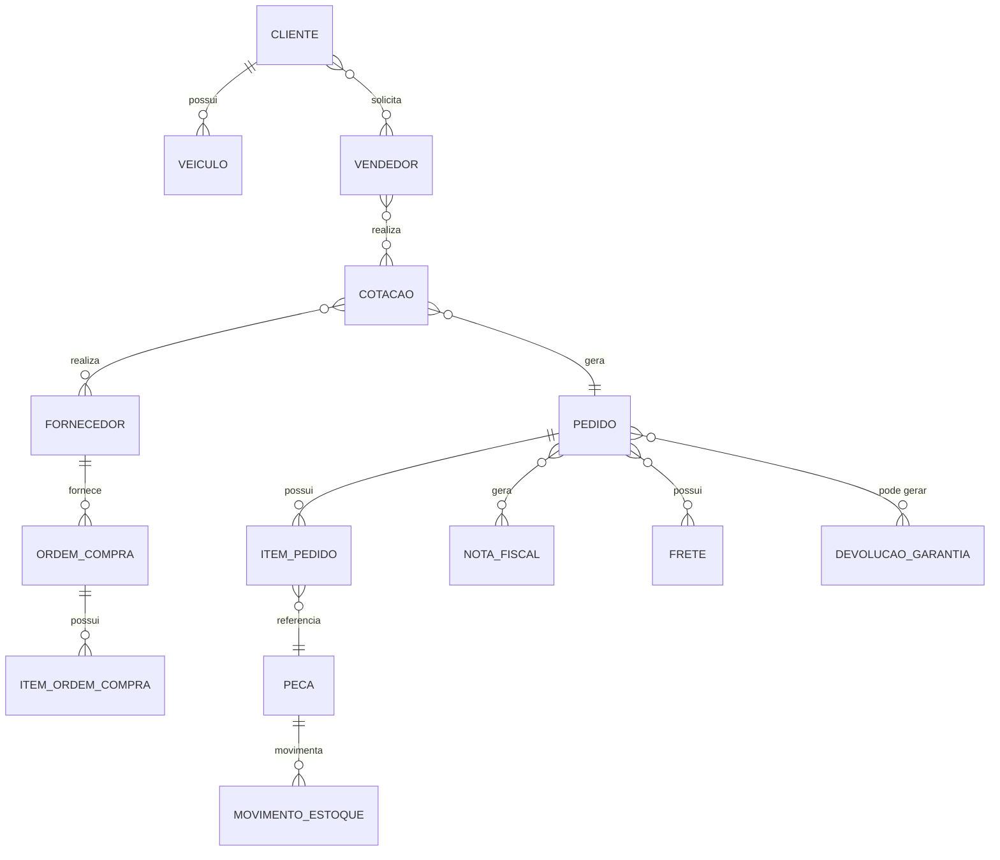
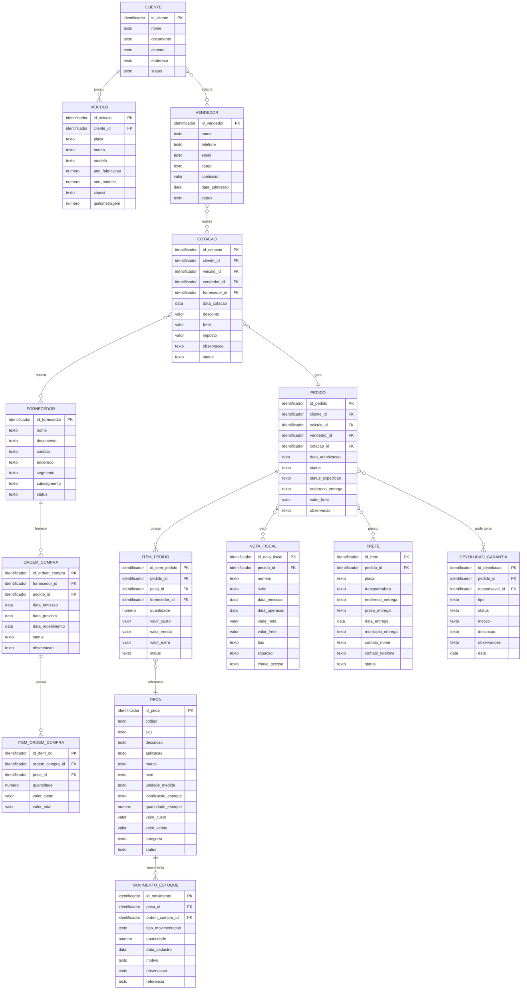

# Projeto-Cid
Modelagem de Banco de dados CK Autoshop
# Modelagem de Banco de Dados — CK Autoshop

Trabalho acadêmico de levantamento de requisitos e modelagem conceitual de banco de dados, desenvolvido a partir de entrevista realizada na empresa CK Autoshop.

## Metadados

| Campo | Informação |
|---|---|
| **Organização** | CK Autoshop |
| **Disciplina** | Modelagem de Banco de Dados (MBD) |
| **Data** | 25/09/2026 |

**Integrantes**

| Nome | RGM |
|---|---|
| Leandro Marques Coelho | 47079894 |
| Gustavo Henrique Bispo Costa | 48010677 |
| Renan Marcelino da Silva | 49876414 |
| Pedro Henrique Ferreira de Souza | 47266031 |
| Pablo Paiva Rover | 48204668 |
---

## 1. Caracterização da Organização

### 1.1 A empresa

A **CK Autoshop** atua no segmento de peças e componentes automotivos. Sua operação envolve compra e venda de peças, atendimento a clientes empresariais, controle de estoque, expedição, transporte, faturamento e pós-venda.

A empresa trabalha principalmente no modelo **B2B (Business to Business)**, atendendo locadoras, frotistas, oficinas, seguradoras e empresas que administram frotas.

### 1.2 Entrevista e levantamento

A entrevista teve como objetivo entender o funcionamento da empresa: processos, setores envolvidos, informações registradas no sistema e dificuldades da operação.

A CK Autoshop possui **sistema próprio de gestão**, que controla cotações, compras, fornecedores, clientes, estoque, pedidos, notas fiscais, financeiro, devoluções, garantias e acompanhamento das operações.

**Perguntas aplicadas na entrevista:**

- **Cadastros:** Como uma peça é cadastrada? Como são cadastrados clientes/membros?
- **Compras:** Como uma compra é registrada? Quem compra? De quem compra? O que é comprado?
- **Estoque:** Como a peça entra no estoque? Como a peça sai do estoque? O que acontece com o estoque depois da venda? Como controlam produtos/estoque?
- **Vendas e pedidos:** Como uma venda é registrada? Quem vende? Para quem vende? Como registram vendas ou atendimentos? Como organizam pedidos?
- **Financeiro:** Como controlam pagamentos?
- **Pessoas e rotina:** Quem trabalha lá? Quem participa de cada etapa? Quais atividades são realizadas?
- **Sistemas e informações:** Quais informações são registradas no sistema? Usam papel, Excel, sistema?
- **Dificuldades:** Quais problemas enfrentam atualmente?

---

## 2. Processos de Negócio

### 2.1 Cadastro de peças
As peças são cadastradas com as informações necessárias para identificação e comercialização: código, descrição, marca/fabricante, aplicação, fornecedor, custo e valor de venda.

### 2.2 Cadastro de clientes e veículos
Os clientes são cadastrados e vinculados às operações comerciais. Também são registradas informações dos veículos: **placa, marca, modelo, ano** e **quilometragem**, quando necessária.

### 2.3 Cotação e venda
O processo comercial começa com a solicitação do cliente. A equipe pesquisa as peças, monta a cotação e define custo, margem e valor de venda. A cotação pode conter cliente, veículo, peças, quantidades, valores, descontos e demais custos.

**Status identificados:** `Pendente → Enviada → Aprovada/Reprovada → Cancelada`

Aprovada a cotação, o processo segue para o pedido.

**Fluxo:** `Cliente → Cotação → Aprovação → Pedido`

### 2.4 Compra
A compra é feita junto aos fornecedores e normalmente atende a uma necessidade de um pedido. É registrada por meio de uma **Ordem de Compra**, com fornecedor, itens, quantidades, valores, datas e pedido relacionado.

**Fluxo:** `Necessidade → Ordem de Compra → Fornecedor → Recebimento → Conferência → Estoque`

### 2.5 Controle de estoque
O estoque é controlado pelas entradas e saídas das peças, relacionadas a compras, pedidos e vendas. O controle permite acompanhar disponibilidade, quantidades, custos, fornecedores e movimentações. Existem processos específicos para **devoluções e garantias**.

**Fluxo:** `Entrada → Estoque → Separação → Saída`

### 2.6 Expedição, embalagem e despacho
Confirmada a disponibilidade das peças, a equipe de expedição faz separação, conferência, embalagem e despacho. São usados materiais de proteção como **plástico-bolha, fitas, papelão, isopor** e outros adequados ao tipo de peça. Depois da embalagem, o pedido segue para transporte.

**Fluxo:** `Pedido → Separação → Conferência → Embalagem → Despacho → Transporte → Entrega`

### 2.7 Processo financeiro
Envolve faturamento, notas fiscais e contas a receber. São acompanhados valor, desconto, valor líquido, vencimento, status e data de pagamento.

**Fluxo:** `Faturamento → Nota Fiscal → Conta a Receber → Vencimento → Pagamento`

### 2.8 Pós-venda
Após a entrega, a empresa acompanha a operação e trata situações como problemas no recebimento, devoluções e garantias.

**Fluxo:** `Entrega → Acompanhamento → Ocorrência/Devolução/Garantia (quando aplicável)`

### 2.9 Fluxogramas

Os processos descritos acima foram representados em três fluxogramas:

- **4.1** — Processo de Cotação e Venda
- **4.2** — Processo de Compra e Entrada no Estoque
- **4.3** — Processo de Separação, Embalagem, Expedição e Entrega

---

## 3. Problemas e Necessidades Identificados

O principal desafio apontado na entrevista é a **integração e a rastreabilidade das informações** ao longo da operação, que passa por cotação, compra, estoque, expedição, transporte, faturamento, financeiro e pós-venda.

Problemas levantados:

- Dificuldade de acompanhar o status dos pedidos;
- Atrasos de fornecedores e pedidos aguardando peças;
- Falta de visibilidade sobre prazos;
- Necessidade de controlar a margem real das vendas;
- Dificuldade de rastrear toda a operação;
- Informações espalhadas entre sistema, planilhas, PDFs e WhatsApp;
- Controle de devoluções e garantias;
- Necessidade de integração entre os setores;
- Rastreabilidade de documentos;
- Necessidade de indicadores para acompanhamento da operação.

### 3.1 Problema central

A CK Autoshop precisa de uma estrutura de informações que integre e permita rastrear as etapas da operação, facilitando o acompanhamento de pedidos, peças, compras, estoque, vendas, expedições, entregas e processos relacionados.

---

## 4. Requisitos do Sistema

Os requisitos vieram da entrevista, dos processos observados e das informações identificadas no sistema usado pela empresa.

### 4.1 Requisitos Funcionais

| ID | Requisito | Descrição |
|---|---|---|
| **RF01** | Cadastro de peças | Cadastrar e consultar peças, com as informações necessárias para identificação, aplicação e comercialização. |
| **RF02** | Cadastro de clientes | Cadastrar e consultar clientes para uso em cotações, pedidos e vendas. |
| **RF03** | Cadastro de veículos | Registrar veículos relacionados aos clientes, com placa, marca, modelo e ano. |
| **RF04** | Cadastro de fornecedores | Cadastrar e consultar fornecedores de peças automotivas. |
| **RF05** | Registro de cotações | Criar cotações relacionando cliente, veículo, peças, quantidades e valores. |
| **RF06** | Status das cotações | Acompanhar o andamento das cotações: pendente, enviada, aprovada, reprovada e cancelada. |
| **RF07** | Registro de pedidos | Gerar e acompanhar pedidos originados das operações comerciais. |
| **RF08** | Ordens de Compra | Registrar Ordens de Compra relacionando fornecedores, peças, quantidades e valores. |
| **RF09** | Recebimento e conferência | Registrar o recebimento e a conferência das peças adquiridas. |
| **RF10** | Entrada e saída de estoque | Registrar as movimentações de estoque e manter o controle das quantidades disponíveis. |
| **RF11** | Controle de expedição | Acompanhar separação, conferência, embalagem e despacho dos pedidos. |
| **RF12** | Faturamento e notas fiscais | Registrar e relacionar faturamento e notas fiscais aos pedidos e respectivas operações. |
| **RF13** | Transporte e entrega | Registrar e acompanhar informações de transporte e entrega dos pedidos. |
| **RF14** | Controle financeiro | Acompanhar valores, vencimentos, pagamentos e situações financeiras das operações. |
| **RF15** | Devoluções e garantias | Registrar e acompanhar processos de devolução e garantia de peças. |
| **RF16** | Consulta e rastreabilidade | Consultar histórico e situação das operações, facilitando a rastreabilidade de pedidos, peças e documentos. |

### 4.2 Requisitos Não Funcionais

| ID | Requisito | Descrição |
|---|---|---|
| **RNF01** | Segurança | Controlar o acesso às informações conforme os usuários e suas responsabilidades. |
| **RNF02** | Integridade dos dados | Manter de forma consistente os relacionamentos entre clientes, veículos, peças, pedidos, compras, estoque e demais operações. |
| **RNF03** | Usabilidade | Apresentar as informações de forma organizada e compreensível para os diferentes setores. |
| **RNF04** | Rastreabilidade | Permitir o acompanhamento do histórico das operações e de suas alterações. |
| **RNF05** | Disponibilidade | Estar disponível durante a operação da empresa. |

---

## 5. Regras de Negócio

Condições e restrições observadas no funcionamento da CK Autoshop que devem ser consideradas na organização dos dados.

| ID | Regra | Descrição |
|---|---|---|
| **RN01** | Identificação do cliente | Uma cotação ou pedido deve estar associado a um cliente. |
| **RN02** | Veículo | Quando a operação envolver um veículo, suas informações devem ser registradas e vinculadas ao cliente correspondente. |
| **RN03** | Itens da cotação | Uma cotação pode ter um ou mais itens, cada um relacionado a uma peça e contendo quantidade e valores. |
| **RN04** | Aprovação da cotação | Uma cotação aprovada pode dar continuidade ao processo e originar um pedido. |
| **RN05** | Ordem de Compra | Deve estar relacionada a um fornecedor e conter os itens que serão adquiridos. |
| **RN06** | Recebimento | As peças adquiridas devem ser recebidas e conferidas antes do registro de entrada no sistema. |
| **RN07** | Entrada no estoque | Após a conferência, a entrada da mercadoria deve ser registrada para atualizar o estoque. |
| **RN08** | Movimentação de estoque | As quantidades disponíveis devem ser atualizadas conforme as entradas e saídas registradas. |
| **RN09** | Saída de estoque | A saída de uma peça deve estar relacionada à operação que originou sua destinação, permitindo rastrear a movimentação. |
| **RN10** | Status dos pedidos | Os pedidos devem ter status representando sua situação dentro do processo operacional. |
| **RN11** | Expedição | Antes do despacho, os itens destinados ao cliente devem ser separados e conferidos. |
| **RN12** | Embalagem | As peças devem ser embaladas conforme suas características, com materiais de proteção adequados (plástico-bolha, papelão, isopor e fitas). |
| **RN13** | Devoluções e garantias | Devem ser registradas e tratadas como ocorrências específicas, não como vendas ou movimentações normais. |
| **RN14** | Faturamento | As informações de Nota Fiscal devem estar relacionadas à operação correspondente. |
| **RN15** | Financeiro | Os valores a receber devem ter informações que permitam acompanhar vencimento, pagamento e situação financeira. |
| **RN16** | Rastreabilidade | As operações devem manter informações suficientes para identificar origem, responsáveis e etapas realizadas. |

---

## 6. Modelagem Conceitual

As entidades foram identificadas a partir dos processos levantados na entrevista e das estruturas observadas no sistema da CK Autoshop. O modelo conceitual usa apenas as entidades do recorte principal da operação, sem reproduzir toda a complexidade do banco de dados existente.

### 6.1 Entidades e atributos

| Entidade | Descrição | Principais atributos |
|---|---|---|
| **Cliente** | Empresas atendidas pela CK Autoshop | ID do cliente; documento; nome/razão social; contato; endereço; status |
| **Veículo** | Veículo relacionado ao atendimento do cliente | ID do veículo; placa; marca; modelo; ano de fabricação; ano do modelo; chassi (quando aplicável) |
| **Peça/Mercadoria** | Produtos e peças automotivas comercializados | ID da peça; código; SKU; nome/descrição; aplicação; marca/fabricante; NCM; unidade de medida; localização no estoque; quantidade em estoque; valor de custo; valor de venda; categoria |
| **Fornecedor** | Empresas que fornecem peças para a CK Autoshop | ID do fornecedor; nome/razão social; documento; contato; endereço; status |
| **Usuário** | Pessoa responsável pelo registro e pelo acompanhamento das operações | ID do usuário *(demais atributos a levantar — ver seção 8.5)* |
| **Cotação** | Proposta comercial elaborada para o cliente | ID da cotação; cliente; responsável; status; placa/veículo; data de entrada; desconto; frete; impostos; comissão; antecipação; observação |
| **Item da Cotação** | Cada peça incluída em uma cotação | ID do item; ID da cotação; ID da peça; quantidade; valor de custo; valor de venda; aplicação; data de entrega; status de aprovação |
| **Pedido** | Operação comercial gerada após a aprovação da cotação | ID do pedido; cliente; veículo; cotação de origem; responsável; data de autorização; status; status da expedição; valor do frete; observação |
| **Item do Pedido** | Cada peça pertencente a um pedido | ID do item; ID do pedido; quantidade; descrição; valor de custo; valor de venda; valor adicional; status; fornecedor |
| **Ordem de Compra** | Aquisição de peças junto a um fornecedor | ID da Ordem de Compra; fornecedor/cliente relacionado; responsável; data de autorização; Nota Fiscal; placa; status; data de cadastro; data de alteração |
| **Item da Ordem de Compra** | Cada peça incluída em uma Ordem de Compra | ID do item; ID da Ordem de Compra; ID da peça; quantidade; valor |
| **Movimento de Estoque** | Entradas e saídas das peças no estoque | ID da movimentação; ID da peça; quantidade; tipo de movimentação; motivo; data de cadastro; usuário responsável |
| **Nota Fiscal** | Documento fiscal da operação | ID da Nota Fiscal; pedido; número; série; data de emissão; data da operação; valor da nota; valor do frete; tipo; situação; chave de acesso |
| **Frete** | Transporte e entrega da mercadoria | ID do frete; pedido; placa; status; endereço de entrega; prazo; número da nota; data de entrega; município de entrega; nome do contato; telefone do contato |
| **Devolução/Garantia** | Ocorrências de devolução ou garantia de peças | ID da ocorrência; Ordem de Compra relacionada; status; cliente; placa; Nota Fiscal; motivo; descrição; observações; data; responsável |
| **Título Financeiro** | Registros financeiros das operações | ID; tipo; status; origem; valor total; descrição; referência externa; data de cadastro; data de alteração |
| **Parcela Financeira** | Parcelas vinculadas aos títulos financeiros | ID; título financeiro; número; total de parcelas; vencimento; valor; status; data de pagamento |

> **Observação sobre a nomenclatura:** no banco da empresa essa estrutura aparece como **Mercadoria**. No modelo conceitual do trabalho usamos **Peça/Mercadoria**, já que "peça" é o termo empregado pela empresa na descrição dos processos.

### 6.2 Relacionamentos e cardinalidades

**Convenção adotada:** `1` (exatamente um) · `0..1` (zero ou um) · `1..N` (um ou vários) ·
`0..N` (zero ou vários). A leitura é *Entidade A → Entidade B*.

| Nº | Entidade A | Relacionamento | Entidade B | Cardinalidade | Justificativa |
|---|---|---|---|---|---|
| 1 | Cliente | possui | Veículo | `1 : 0..N` | Um cliente pode possuir zero ou vários veículos |
| 2 | Cliente | realiza | Cotação | `1 : 0..N` | RN01; o cadastro de cliente (RF02) é processo próprio, logo pode existir cliente sem cotação |
| 3 | Cliente | realiza | Pedido | `1 : 0..N` | RN01 — todo pedido deve estar associado a um cliente |
| 4 | Veículo | relaciona-se a | Cotação | `0..1 : 0..N` | RN02: o veículo é registrado quando a operação o envolve |
| 5 | Veículo | relaciona-se a | Pedido | `0..1 : 0..N` | RN02, que trata da operação de modo geral, não só da cotação |
| 6 | Cotação | contém | Item da Cotação | `1 : 1..N` | RN03: uma cotação possui um ou mais itens |
| 7 | Peça/Mercadoria | é solicitada em | Item da Cotação | `1 : 0..N` | Uma peça cadastrada pode ainda não ter sido cotada |
| 8 | Cotação | gera | Pedido | `1 : 0..1` | RN04; nem toda cotação vira pedido |
| 9 | Pedido | contém | Item do Pedido | `1 : 1..N` | Um pedido possui um ou vários itens |
| 10 | Peça/Mercadoria | compõe | Item do Pedido | `1 : 0..N` | Uma peça pode não estar em nenhum pedido |
| 11 | Fornecedor | fornece | Item do Pedido | `0..1 : 0..N` | O fornecedor do item é informado quando a operação exige |
| 12 | Fornecedor | recebe | Ordem de Compra | `1 : 0..N` | RN05: toda OC está relacionada a um fornecedor |
| 13 | Pedido | origina | Ordem de Compra | `0..1 : 0..N` | Seção 2.4 e RN05: como cada OC tem um só fornecedor e cada item do pedido pode ter fornecedor diferente, um pedido pode originar várias OCs |
| 14 | Ordem de Compra | contém | Item da Ordem de Compra | `1 : 1..N` | RN05: a OC contém os itens que serão adquiridos |
| 15 | Peça/Mercadoria | é adquirida em | Item da Ordem de Compra | `1 : 0..N` | Uma peça pode nunca ter sido comprada |
| 16 | Peça/Mercadoria | movimenta | Movimento de Estoque | `1 : 0..N` | RN08; peça recém-cadastrada pode não ter movimentação |
| 17 | Pedido | é faturado por | Nota Fiscal | `1 : 0..1` | RN14 e RF12; o pedido pode ainda não ter sido faturado |
| 18 | Pedido | possui | Frete | `1 : 0..1` | Seção 2.6 e RF13; nem todo pedido tem transporte registrado |
| 19 | Pedido | pode gerar | Devolução/Garantia | `1 : 0..N` | RN13 e seção 2.8 — ver ressalva na seção 8.5 |
| 20 | Título Financeiro | possui | Parcela Financeira | `1 : 1..N` | RN15: toda parcela pertence a um título |
| 21 | Usuário | é responsável por | Cotação | `1 : 0..N` | RN16 e RNF01 |
| 22 | Usuário | é responsável por | Pedido | `1 : 0..N` | RN16 e RNF01 |
| 23 | Usuário | é responsável por | Ordem de Compra | `1 : 0..N` | RN16 e RNF01 |
| 24 | Usuário | registra | Movimento de Estoque | `1 : 0..N` | RN16: identificar quem realizou o registro |
| 25 | Usuário | é responsável por | Devolução/Garantia | `1 : 0..N` | RN16 e RNF01 |

---

## 7. Dicionário de Dados e Estrutura SQL

O dicionário de dados a seguir traduz o DER da seção 8 em uma proposta de estrutura relacional (PostgreSQL): tipos, tamanhos, obrigatoriedade e restrições para cada campo, além do script SQL de cada tabela e do script completo. É uma **proposta de modelagem** — tipos, tamanhos, obrigatoriedade e estados foram sugeridos a partir do DER; o SQL aplica restrições locais, e regras que envolvem várias tabelas ainda exigem implementação (transações/triggers).

**Resumo:** 14 entidades originais do DER + 1 tabela proposta (`item_cotacao`) · 15 tabelas ao todo · script em PostgreSQL.

### 7.1 Conceitos e convenções

| Termo | Significado |
|---|---|
| Campo / registro / tabela | Coluna / linha / conjunto de registros. |
| PK / FK / UNIQUE | Identificador único / referência a outra tabela / proibição de duplicidade. |
| NOT NULL / CHECK | Preenchimento obrigatório / validação de condição. |
| VARCHAR(n) / TEXT | Texto limitado / texto longo. Documentos e códigos preservam zeros iniciais. |
| INTEGER / DECIMAL(12,2) | Número inteiro / número exato com duas casas decimais. |
| DATE / TIMESTAMP | Data / data e horário sem fuso nesta proposta. |
| Índice | Estrutura de apoio às buscas; o SQL inclui índices para as FKs. |
| Dado → informação → conhecimento | Fato isolado → contexto → aplicação para decisões. |

**Fluxo principal:** Cliente e veículo → Cotação e itens → Pedido e itens → Nota fiscal e entrega. Compras alimentam o estoque. Devoluções e garantias acompanham o pós-venda.

**Premissas adotadas nesta proposta:**

- Quantidades inteiras. Para venda fracionada, adotar DECIMAL em todos os campos de quantidade relacionados.
- Uma cotação pode gerar vários pedidos. Cada pedido referencia uma cotação obrigatória.
- Desconto, imposto e frete são valores monetários; comissão é percentual.
- Estados não enumerados permanecem como texto obrigatório até definição do fluxo.
- Scripts individuais dependem das tabelas referenciadas. O script completo já está ordenado.
- CRUD: cadastrar, consultar, alterar e excluir quando a integridade permitir.

### 7.2 Dicionário por tabela

#### 7.2.1 `cliente` — Clientes
**Grupo:** Cadastro · **Campos:** 6 · **Depende de:** sem dependências

Cadastro de pessoas e empresas atendidas.

| Campo | Tipo | Descrição | Restrições |
|---|---|---|---|
| `id_cliente` **PK** | `INTEGER` | Identificador único e automático | Automático, único e obrigatório |
| `nome` | `VARCHAR(150)` | Nome ou razão social | NOT NULL |
| `documento` | `VARCHAR(14)` | CPF ou CNPJ, somente dígitos | NOT NULL UNIQUE CHECK (documento ~ '^([0-9]{11}|[0-9]{14})$') |
| `contato` | `VARCHAR(150)` | Telefone ou outro contato | NOT NULL |
| `endereco` | `VARCHAR(255)` | Endereço do cliente | Opcional |
| `status` | `VARCHAR(20)` | Situação cadastral | NOT NULL DEFAULT 'ativo' CHECK (status IN ('ativo', 'inativo')) |

<details><summary>Script SQL — <code>cliente</code></summary>

```sql
-- Clientes
CREATE TABLE cliente (
  id_cliente INTEGER GENERATED ALWAYS AS IDENTITY PRIMARY KEY,
  nome VARCHAR(150) NOT NULL,
  documento VARCHAR(14) NOT NULL UNIQUE CHECK (documento ~ '^([0-9]{11}|[0-9]{14})$'),
  contato VARCHAR(150) NOT NULL,
  endereco VARCHAR(255),
  status VARCHAR(20) NOT NULL DEFAULT 'ativo' CHECK (status IN ('ativo', 'inativo'))
);

COMMENT ON TABLE cliente IS 'Cadastro de pessoas e empresas atendidas.';
COMMENT ON COLUMN cliente.id_cliente IS 'Identificador único e automático';
COMMENT ON COLUMN cliente.nome IS 'Nome ou razão social';
COMMENT ON COLUMN cliente.documento IS 'CPF ou CNPJ, somente dígitos';
COMMENT ON COLUMN cliente.contato IS 'Telefone ou outro contato';
COMMENT ON COLUMN cliente.endereco IS 'Endereço do cliente';
COMMENT ON COLUMN cliente.status IS 'Situação cadastral';
```
</details>

#### 7.2.2 `veiculo` — Veículos
**Grupo:** Cadastro · **Campos:** 9 · **Depende de:** `cliente`

Veículos vinculados aos clientes.

| Campo | Tipo | Descrição | Restrições |
|---|---|---|---|
| `id_veiculo` **PK** | `INTEGER` | Identificador único e automático | Automático, único e obrigatório |
| `cliente_id` **FK** | `INTEGER` | Proprietário cadastrado | NOT NULL REFERENCES cliente(id_cliente) ON DELETE RESTRICT |
| `placa` | `VARCHAR(7)` | Placa sem separadores | UNIQUE |
| `marca` | `VARCHAR(60)` | Fabricante | NOT NULL |
| `modelo` | `VARCHAR(80)` | Modelo do veículo | NOT NULL |
| `ano_fabricacao` | `INTEGER` | Ano de fabricação | CHECK (ano_fabricacao BETWEEN 1886 AND 9999) |
| `ano_modelo` | `INTEGER` | Ano do modelo | CHECK (ano_modelo BETWEEN 1886 AND 9999) |
| `chassi` | `VARCHAR(17)` | Identificação do chassi | UNIQUE |
| `quilometragem` | `INTEGER` | Quilometragem registrada | CHECK (quilometragem >= 0) |

<details><summary>Script SQL — <code>veiculo</code></summary>

```sql
-- Veículos
CREATE TABLE veiculo (
  id_veiculo INTEGER GENERATED ALWAYS AS IDENTITY PRIMARY KEY,
  cliente_id INTEGER NOT NULL REFERENCES cliente(id_cliente) ON DELETE RESTRICT,
  placa VARCHAR(7) UNIQUE,
  marca VARCHAR(60) NOT NULL,
  modelo VARCHAR(80) NOT NULL,
  ano_fabricacao INTEGER CHECK (ano_fabricacao BETWEEN 1886 AND 9999),
  ano_modelo INTEGER CHECK (ano_modelo BETWEEN 1886 AND 9999),
  chassi VARCHAR(17) UNIQUE,
  quilometragem INTEGER CHECK (quilometragem >= 0)
);

COMMENT ON TABLE veiculo IS 'Veículos vinculados aos clientes.';
COMMENT ON COLUMN veiculo.id_veiculo IS 'Identificador único e automático';
COMMENT ON COLUMN veiculo.cliente_id IS 'Proprietário cadastrado';
COMMENT ON COLUMN veiculo.placa IS 'Placa sem separadores';
COMMENT ON COLUMN veiculo.marca IS 'Fabricante';
COMMENT ON COLUMN veiculo.modelo IS 'Modelo do veículo';
COMMENT ON COLUMN veiculo.ano_fabricacao IS 'Ano de fabricação';
COMMENT ON COLUMN veiculo.ano_modelo IS 'Ano do modelo';
COMMENT ON COLUMN veiculo.chassi IS 'Identificação do chassi';
COMMENT ON COLUMN veiculo.quilometragem IS 'Quilometragem registrada';

-- Índices de apoio às FKs
CREATE INDEX idx_veiculo_cliente_id ON veiculo (cliente_id);
```
</details>

#### 7.2.3 `vendedor` — Vendedores
**Grupo:** Cadastro · **Campos:** 8 · **Depende de:** sem dependências

Profissionais responsáveis pelas vendas.

| Campo | Tipo | Descrição | Restrições |
|---|---|---|---|
| `id_vendedor` **PK** | `INTEGER` | Identificador único e automático | Automático, único e obrigatório |
| `nome` | `VARCHAR(150)` | Nome completo | NOT NULL |
| `telefone` | `VARCHAR(20)` | Telefone de contato | Opcional |
| `email` | `VARCHAR(150)` | E-mail profissional | Opcional |
| `cargo` | `VARCHAR(60)` | Cargo ocupado | NOT NULL |
| `comissao` | `DECIMAL(5,2)` | Percentual de comissão | NOT NULL DEFAULT 0 CHECK (comissao BETWEEN 0 AND 100) |
| `data_admissao` | `DATE` | Data de admissão | NOT NULL |
| `status` | `VARCHAR(20)` | Situação cadastral | NOT NULL DEFAULT 'ativo' CHECK (status IN ('ativo', 'inativo')) |

<details><summary>Script SQL — <code>vendedor</code></summary>

```sql
-- Vendedores
CREATE TABLE vendedor (
  id_vendedor INTEGER GENERATED ALWAYS AS IDENTITY PRIMARY KEY,
  nome VARCHAR(150) NOT NULL,
  telefone VARCHAR(20),
  email VARCHAR(150),
  cargo VARCHAR(60) NOT NULL,
  comissao DECIMAL(5,2) NOT NULL DEFAULT 0 CHECK (comissao BETWEEN 0 AND 100),
  data_admissao DATE NOT NULL,
  status VARCHAR(20) NOT NULL DEFAULT 'ativo' CHECK (status IN ('ativo', 'inativo'))
);

COMMENT ON TABLE vendedor IS 'Profissionais responsáveis pelas vendas.';
COMMENT ON COLUMN vendedor.id_vendedor IS 'Identificador único e automático';
COMMENT ON COLUMN vendedor.nome IS 'Nome completo';
COMMENT ON COLUMN vendedor.telefone IS 'Telefone de contato';
COMMENT ON COLUMN vendedor.email IS 'E-mail profissional';
COMMENT ON COLUMN vendedor.cargo IS 'Cargo ocupado';
COMMENT ON COLUMN vendedor.comissao IS 'Percentual de comissão';
COMMENT ON COLUMN vendedor.data_admissao IS 'Data de admissão';
COMMENT ON COLUMN vendedor.status IS 'Situação cadastral';
```
</details>

#### 7.2.4 `fornecedor` — Fornecedores
**Grupo:** Cadastro · **Campos:** 8 · **Depende de:** sem dependências

Parceiros que fornecem peças e produtos.

| Campo | Tipo | Descrição | Restrições |
|---|---|---|---|
| `id_fornecedor` **PK** | `INTEGER` | Identificador único e automático | Automático, único e obrigatório |
| `nome` | `VARCHAR(150)` | Nome ou razão social | NOT NULL |
| `documento` | `VARCHAR(14)` | CPF ou CNPJ, somente dígitos | NOT NULL UNIQUE CHECK (documento ~ '^([0-9]{11}|[0-9]{14})$') |
| `contato` | `VARCHAR(150)` | Contato comercial | NOT NULL |
| `endereco` | `VARCHAR(255)` | Endereço comercial | Opcional |
| `segmento` | `VARCHAR(80)` | Área de atuação | Opcional |
| `subsegmento` | `VARCHAR(80)` | Especialidade do fornecedor | Opcional |
| `status` | `VARCHAR(20)` | Situação cadastral | NOT NULL DEFAULT 'ativo' CHECK (status IN ('ativo', 'inativo')) |

<details><summary>Script SQL — <code>fornecedor</code></summary>

```sql
-- Fornecedores
CREATE TABLE fornecedor (
  id_fornecedor INTEGER GENERATED ALWAYS AS IDENTITY PRIMARY KEY,
  nome VARCHAR(150) NOT NULL,
  documento VARCHAR(14) NOT NULL UNIQUE CHECK (documento ~ '^([0-9]{11}|[0-9]{14})$'),
  contato VARCHAR(150) NOT NULL,
  endereco VARCHAR(255),
  segmento VARCHAR(80),
  subsegmento VARCHAR(80),
  status VARCHAR(20) NOT NULL DEFAULT 'ativo' CHECK (status IN ('ativo', 'inativo'))
);

COMMENT ON TABLE fornecedor IS 'Parceiros que fornecem peças e produtos.';
COMMENT ON COLUMN fornecedor.id_fornecedor IS 'Identificador único e automático';
COMMENT ON COLUMN fornecedor.nome IS 'Nome ou razão social';
COMMENT ON COLUMN fornecedor.documento IS 'CPF ou CNPJ, somente dígitos';
COMMENT ON COLUMN fornecedor.contato IS 'Contato comercial';
COMMENT ON COLUMN fornecedor.endereco IS 'Endereço comercial';
COMMENT ON COLUMN fornecedor.segmento IS 'Área de atuação';
COMMENT ON COLUMN fornecedor.subsegmento IS 'Especialidade do fornecedor';
COMMENT ON COLUMN fornecedor.status IS 'Situação cadastral';
```
</details>

#### 7.2.5 `peca` — Peças
**Grupo:** Estoque · **Campos:** 14 · **Depende de:** sem dependências

Catálogo de produtos, preços atuais e saldo de estoque.

| Campo | Tipo | Descrição | Restrições |
|---|---|---|---|
| `id_peca` **PK** | `INTEGER` | Identificador único e automático | Automático, único e obrigatório |
| `codigo` | `VARCHAR(50)` | Código comercial | NOT NULL UNIQUE |
| `sku` | `VARCHAR(50)` | Código interno de estoque | NOT NULL UNIQUE |
| `descricao` | `VARCHAR(255)` | Descrição da peça | NOT NULL |
| `aplicacao` | `TEXT` | Veículos e condições de aplicação | Opcional |
| `marca` | `VARCHAR(80)` | Marca da peça | NOT NULL |
| `ncm` | `VARCHAR(8)` | Classificação fiscal, quando informada | CHECK (ncm ~ '^[0-9]{8}$') |
| `unidade_medida` | `VARCHAR(10)` | Unidade de comercialização | NOT NULL |
| `localizacao_estoque` | `VARCHAR(100)` | Local físico de armazenamento | Opcional |
| `quantidade_estoque` | `INTEGER` | Saldo registrado | NOT NULL DEFAULT 0 CHECK (quantidade_estoque >= 0) |
| `valor_custo` | `DECIMAL(12,2)` | Custo unitário atual | NOT NULL CHECK (valor_custo >= 0) |
| `valor_venda` | `DECIMAL(12,2)` | Preço unitário atual | NOT NULL CHECK (valor_venda >= 0) |
| `categoria` | `VARCHAR(80)` | Classificação comercial | Opcional |
| `status` | `VARCHAR(20)` | Situação cadastral | NOT NULL DEFAULT 'ativo' CHECK (status IN ('ativo', 'inativo')) |

<details><summary>Script SQL — <code>peca</code></summary>

```sql
-- Peças
CREATE TABLE peca (
  id_peca INTEGER GENERATED ALWAYS AS IDENTITY PRIMARY KEY,
  codigo VARCHAR(50) NOT NULL UNIQUE,
  sku VARCHAR(50) NOT NULL UNIQUE,
  descricao VARCHAR(255) NOT NULL,
  aplicacao TEXT,
  marca VARCHAR(80) NOT NULL,
  ncm VARCHAR(8) CHECK (ncm ~ '^[0-9]{8}$'),
  unidade_medida VARCHAR(10) NOT NULL,
  localizacao_estoque VARCHAR(100),
  quantidade_estoque INTEGER NOT NULL DEFAULT 0 CHECK (quantidade_estoque >= 0),
  valor_custo DECIMAL(12,2) NOT NULL CHECK (valor_custo >= 0),
  valor_venda DECIMAL(12,2) NOT NULL CHECK (valor_venda >= 0),
  categoria VARCHAR(80),
  status VARCHAR(20) NOT NULL DEFAULT 'ativo' CHECK (status IN ('ativo', 'inativo'))
);

COMMENT ON TABLE peca IS 'Catálogo de produtos, preços atuais e saldo de estoque.';
COMMENT ON COLUMN peca.id_peca IS 'Identificador único e automático';
COMMENT ON COLUMN peca.codigo IS 'Código comercial';
COMMENT ON COLUMN peca.sku IS 'Código interno de estoque';
COMMENT ON COLUMN peca.descricao IS 'Descrição da peça';
COMMENT ON COLUMN peca.aplicacao IS 'Veículos e condições de aplicação';
COMMENT ON COLUMN peca.marca IS 'Marca da peça';
COMMENT ON COLUMN peca.ncm IS 'Classificação fiscal, quando informada';
COMMENT ON COLUMN peca.unidade_medida IS 'Unidade de comercialização';
COMMENT ON COLUMN peca.localizacao_estoque IS 'Local físico de armazenamento';
COMMENT ON COLUMN peca.quantidade_estoque IS 'Saldo registrado';
COMMENT ON COLUMN peca.valor_custo IS 'Custo unitário atual';
COMMENT ON COLUMN peca.valor_venda IS 'Preço unitário atual';
COMMENT ON COLUMN peca.categoria IS 'Classificação comercial';
COMMENT ON COLUMN peca.status IS 'Situação cadastral';
```
</details>

#### 7.2.6 `cotacao` — Cotações
**Grupo:** Comercial · **Campos:** 11 · **Depende de:** `cliente`, `veiculo`, `vendedor`, `fornecedor`

Cabeçalho das propostas. Desconto, frete e imposto são valores monetários.

| Campo | Tipo | Descrição | Restrições |
|---|---|---|---|
| `id_cotacao` **PK** | `INTEGER` | Identificador único e automático | Automático, único e obrigatório |
| `cliente_id` **FK** | `INTEGER` | Cliente solicitante | NOT NULL REFERENCES cliente(id_cliente) ON DELETE RESTRICT |
| `veiculo_id` **FK** | `INTEGER` | Veículo relacionado | REFERENCES veiculo(id_veiculo) ON DELETE RESTRICT |
| `vendedor_id` **FK** | `INTEGER` | Vendedor responsável | NOT NULL REFERENCES vendedor(id_vendedor) ON DELETE RESTRICT |
| `fornecedor_id` **FK** | `INTEGER` | Fornecedor relacionado | REFERENCES fornecedor(id_fornecedor) ON DELETE RESTRICT |
| `data_cotacao` | `TIMESTAMP` | Data e horário da proposta | NOT NULL DEFAULT CURRENT_TIMESTAMP |
| `desconto` | `DECIMAL(12,2)` | Valor monetário do desconto | NOT NULL DEFAULT 0 CHECK (desconto >= 0) |
| `frete` | `DECIMAL(12,2)` | Frete estimado | NOT NULL DEFAULT 0 CHECK (frete >= 0) |
| `imposto` | `DECIMAL(12,2)` | Impostos estimados | NOT NULL DEFAULT 0 CHECK (imposto >= 0) |
| `observacao` | `TEXT` | Informações adicionais | Opcional |
| `status` | `VARCHAR(20)` | Situação da proposta | NOT NULL DEFAULT 'aberta' CHECK (status IN ('aberta', 'aprovada', 'recusada', 'cancelada', 'expirada')) |

<details><summary>Script SQL — <code>cotacao</code></summary>

```sql
-- Cotações
CREATE TABLE cotacao (
  id_cotacao INTEGER GENERATED ALWAYS AS IDENTITY PRIMARY KEY,
  cliente_id INTEGER NOT NULL REFERENCES cliente(id_cliente) ON DELETE RESTRICT,
  veiculo_id INTEGER REFERENCES veiculo(id_veiculo) ON DELETE RESTRICT,
  vendedor_id INTEGER NOT NULL REFERENCES vendedor(id_vendedor) ON DELETE RESTRICT,
  fornecedor_id INTEGER REFERENCES fornecedor(id_fornecedor) ON DELETE RESTRICT,
  data_cotacao TIMESTAMP NOT NULL DEFAULT CURRENT_TIMESTAMP,
  desconto DECIMAL(12,2) NOT NULL DEFAULT 0 CHECK (desconto >= 0),
  frete DECIMAL(12,2) NOT NULL DEFAULT 0 CHECK (frete >= 0),
  imposto DECIMAL(12,2) NOT NULL DEFAULT 0 CHECK (imposto >= 0),
  observacao TEXT,
  status VARCHAR(20) NOT NULL DEFAULT 'aberta' CHECK (status IN ('aberta', 'aprovada', 'recusada', 'cancelada', 'expirada'))
);

COMMENT ON TABLE cotacao IS 'Cabeçalho das propostas. Desconto, frete e imposto são valores monetários.';
COMMENT ON COLUMN cotacao.id_cotacao IS 'Identificador único e automático';
COMMENT ON COLUMN cotacao.cliente_id IS 'Cliente solicitante';
COMMENT ON COLUMN cotacao.veiculo_id IS 'Veículo relacionado';
COMMENT ON COLUMN cotacao.vendedor_id IS 'Vendedor responsável';
COMMENT ON COLUMN cotacao.fornecedor_id IS 'Fornecedor relacionado';
COMMENT ON COLUMN cotacao.data_cotacao IS 'Data e horário da proposta';
COMMENT ON COLUMN cotacao.desconto IS 'Valor monetário do desconto';
COMMENT ON COLUMN cotacao.frete IS 'Frete estimado';
COMMENT ON COLUMN cotacao.imposto IS 'Impostos estimados';
COMMENT ON COLUMN cotacao.observacao IS 'Informações adicionais';
COMMENT ON COLUMN cotacao.status IS 'Situação da proposta';

-- Índices de apoio às FKs
CREATE INDEX idx_cotacao_cliente_id ON cotacao (cliente_id);
CREATE INDEX idx_cotacao_veiculo_id ON cotacao (veiculo_id);
CREATE INDEX idx_cotacao_vendedor_id ON cotacao (vendedor_id);
CREATE INDEX idx_cotacao_fornecedor_id ON cotacao (fornecedor_id);
```
</details>

#### 7.2.7 `item_cotacao` — Itens da cotação
**Grupo:** Proposta adicional · **Campos:** 6 · **Depende de:** `cotacao`, `peca`

Inclusão proposta para detalhar peças e preços. Ausente no DER original.

> **Observação:** Tabela adicional proposta para detalhar as cotações. Não aparece no DER original.

| Campo | Tipo | Descrição | Restrições |
|---|---|---|---|
| `id_item_cotacao` **PK** | `INTEGER` | Identificador único e automático | Automático, único e obrigatório |
| `cotacao_id` **FK** | `INTEGER` | Cotação correspondente | NOT NULL REFERENCES cotacao(id_cotacao) ON DELETE RESTRICT |
| `peca_id` **FK** | `INTEGER` | Peça cotada | NOT NULL REFERENCES peca(id_peca) ON DELETE RESTRICT |
| `quantidade` | `INTEGER` | Quantidade solicitada | NOT NULL CHECK (quantidade > 0) |
| `valor_unitario` | `DECIMAL(12,2)` | Preço unitário proposto | NOT NULL CHECK (valor_unitario >= 0) |
| `valor_total` | `DECIMAL(12,2)` | Total calculado do item | GENERATED ALWAYS AS (quantidade * valor_unitario) STORED |

<details><summary>Script SQL — <code>item_cotacao</code></summary>

```sql
-- Itens da cotação
-- Inclusão proposta; ausente no DER original.
CREATE TABLE item_cotacao (
  id_item_cotacao INTEGER GENERATED ALWAYS AS IDENTITY PRIMARY KEY,
  cotacao_id INTEGER NOT NULL REFERENCES cotacao(id_cotacao) ON DELETE RESTRICT,
  peca_id INTEGER NOT NULL REFERENCES peca(id_peca) ON DELETE RESTRICT,
  quantidade INTEGER NOT NULL CHECK (quantidade > 0),
  valor_unitario DECIMAL(12,2) NOT NULL CHECK (valor_unitario >= 0),
  valor_total DECIMAL(12,2) GENERATED ALWAYS AS (quantidade * valor_unitario) STORED
);

COMMENT ON TABLE item_cotacao IS 'Inclusão proposta para detalhar peças e preços. Ausente no DER original.';
COMMENT ON COLUMN item_cotacao.id_item_cotacao IS 'Identificador único e automático';
COMMENT ON COLUMN item_cotacao.cotacao_id IS 'Cotação correspondente';
COMMENT ON COLUMN item_cotacao.peca_id IS 'Peça cotada';
COMMENT ON COLUMN item_cotacao.quantidade IS 'Quantidade solicitada';
COMMENT ON COLUMN item_cotacao.valor_unitario IS 'Preço unitário proposto';
COMMENT ON COLUMN item_cotacao.valor_total IS 'Total calculado do item';

-- Índices de apoio às FKs
CREATE INDEX idx_item_cotacao_cotacao_id ON item_cotacao (cotacao_id);
CREATE INDEX idx_item_cotacao_peca_id ON item_cotacao (peca_id);
```
</details>

#### 7.2.8 `pedido` — Pedidos
**Grupo:** Comercial · **Campos:** 11 · **Depende de:** `cliente`, `veiculo`, `vendedor`, `cotacao`

Vendas originadas de cotações. Uma cotação pode gerar vários pedidos nesta proposta.

| Campo | Tipo | Descrição | Restrições |
|---|---|---|---|
| `id_pedido` **PK** | `INTEGER` | Identificador único e automático | Automático, único e obrigatório |
| `cliente_id` **FK** | `INTEGER` | Cliente comprador | NOT NULL REFERENCES cliente(id_cliente) ON DELETE RESTRICT |
| `veiculo_id` **FK** | `INTEGER` | Veículo relacionado | REFERENCES veiculo(id_veiculo) ON DELETE RESTRICT |
| `vendedor_id` **FK** | `INTEGER` | Responsável pela venda | NOT NULL REFERENCES vendedor(id_vendedor) ON DELETE RESTRICT |
| `cotacao_id` **FK** | `INTEGER` | Cotação de origem | NOT NULL REFERENCES cotacao(id_cotacao) ON DELETE RESTRICT |
| `data_autorizacao` | `TIMESTAMP` | Momento da autorização; nulo enquanto pendente | Opcional |
| `status` | `VARCHAR(30)` | Situação comercial | NOT NULL DEFAULT 'rascunho' |
| `status_expedicao` | `VARCHAR(30)` | Etapa de separação e envio | NOT NULL DEFAULT 'pendente' |
| `endereco_entrega` | `VARCHAR(255)` | Exigido na operação quando houver entrega | Opcional |
| `valor_frete` | `DECIMAL(12,2)` | Frete cobrado do cliente | NOT NULL DEFAULT 0 CHECK (valor_frete >= 0) |
| `observacao` | `TEXT` | Informações adicionais | Opcional |

<details><summary>Script SQL — <code>pedido</code></summary>

```sql
-- Pedidos
CREATE TABLE pedido (
  id_pedido INTEGER GENERATED ALWAYS AS IDENTITY PRIMARY KEY,
  cliente_id INTEGER NOT NULL REFERENCES cliente(id_cliente) ON DELETE RESTRICT,
  veiculo_id INTEGER REFERENCES veiculo(id_veiculo) ON DELETE RESTRICT,
  vendedor_id INTEGER NOT NULL REFERENCES vendedor(id_vendedor) ON DELETE RESTRICT,
  cotacao_id INTEGER NOT NULL REFERENCES cotacao(id_cotacao) ON DELETE RESTRICT,
  data_autorizacao TIMESTAMP,
  status VARCHAR(30) NOT NULL DEFAULT 'rascunho',
  status_expedicao VARCHAR(30) NOT NULL DEFAULT 'pendente',
  endereco_entrega VARCHAR(255),
  valor_frete DECIMAL(12,2) NOT NULL DEFAULT 0 CHECK (valor_frete >= 0),
  observacao TEXT
);

COMMENT ON TABLE pedido IS 'Vendas originadas de cotações. Uma cotação pode gerar vários pedidos nesta proposta.';
COMMENT ON COLUMN pedido.id_pedido IS 'Identificador único e automático';
COMMENT ON COLUMN pedido.cliente_id IS 'Cliente comprador';
COMMENT ON COLUMN pedido.veiculo_id IS 'Veículo relacionado';
COMMENT ON COLUMN pedido.vendedor_id IS 'Responsável pela venda';
COMMENT ON COLUMN pedido.cotacao_id IS 'Cotação de origem';
COMMENT ON COLUMN pedido.data_autorizacao IS 'Momento da autorização; nulo enquanto pendente';
COMMENT ON COLUMN pedido.status IS 'Situação comercial';
COMMENT ON COLUMN pedido.status_expedicao IS 'Etapa de separação e envio';
COMMENT ON COLUMN pedido.endereco_entrega IS 'Exigido na operação quando houver entrega';
COMMENT ON COLUMN pedido.valor_frete IS 'Frete cobrado do cliente';
COMMENT ON COLUMN pedido.observacao IS 'Informações adicionais';

-- Índices de apoio às FKs
CREATE INDEX idx_pedido_cliente_id ON pedido (cliente_id);
CREATE INDEX idx_pedido_veiculo_id ON pedido (veiculo_id);
CREATE INDEX idx_pedido_vendedor_id ON pedido (vendedor_id);
CREATE INDEX idx_pedido_cotacao_id ON pedido (cotacao_id);
```
</details>

#### 7.2.9 `item_pedido` — Itens do pedido
**Grupo:** Comercial · **Campos:** 9 · **Depende de:** `pedido`, `peca`, `fornecedor`

Peças vendidas. Os preços históricos não acompanham alterações no catálogo.

| Campo | Tipo | Descrição | Restrições |
|---|---|---|---|
| `id_item_pedido` **PK** | `INTEGER` | Identificador único e automático | Automático, único e obrigatório |
| `pedido_id` **FK** | `INTEGER` | Pedido correspondente | NOT NULL REFERENCES pedido(id_pedido) ON DELETE RESTRICT |
| `peca_id` **FK** | `INTEGER` | Peça comercializada | NOT NULL REFERENCES peca(id_peca) ON DELETE RESTRICT |
| `fornecedor_id` **FK** | `INTEGER` | Fornecedor associado ao item | REFERENCES fornecedor(id_fornecedor) ON DELETE RESTRICT |
| `quantidade` | `INTEGER` | Quantidade vendida | NOT NULL CHECK (quantidade > 0) |
| `valor_custo` | `DECIMAL(12,2)` | Custo unitário registrado na venda | NOT NULL CHECK (valor_custo >= 0) |
| `valor_venda` | `DECIMAL(12,2)` | Preço unitário registrado na venda | NOT NULL CHECK (valor_venda >= 0) |
| `valor_extra` | `DECIMAL(12,2)` | Acréscimo total; subtotal = quantidade × valor_venda + valor_extra | NOT NULL DEFAULT 0 CHECK (valor_extra >= 0) |
| `status` | `VARCHAR(30)` | Situação do item | NOT NULL DEFAULT 'pendente' |

<details><summary>Script SQL — <code>item_pedido</code></summary>

```sql
-- Itens do pedido
CREATE TABLE item_pedido (
  id_item_pedido INTEGER GENERATED ALWAYS AS IDENTITY PRIMARY KEY,
  pedido_id INTEGER NOT NULL REFERENCES pedido(id_pedido) ON DELETE RESTRICT,
  peca_id INTEGER NOT NULL REFERENCES peca(id_peca) ON DELETE RESTRICT,
  fornecedor_id INTEGER REFERENCES fornecedor(id_fornecedor) ON DELETE RESTRICT,
  quantidade INTEGER NOT NULL CHECK (quantidade > 0),
  valor_custo DECIMAL(12,2) NOT NULL CHECK (valor_custo >= 0),
  valor_venda DECIMAL(12,2) NOT NULL CHECK (valor_venda >= 0),
  valor_extra DECIMAL(12,2) NOT NULL DEFAULT 0 CHECK (valor_extra >= 0),
  status VARCHAR(30) NOT NULL DEFAULT 'pendente'
);

COMMENT ON TABLE item_pedido IS 'Peças vendidas. Os preços históricos não acompanham alterações no catálogo.';
COMMENT ON COLUMN item_pedido.id_item_pedido IS 'Identificador único e automático';
COMMENT ON COLUMN item_pedido.pedido_id IS 'Pedido correspondente';
COMMENT ON COLUMN item_pedido.peca_id IS 'Peça comercializada';
COMMENT ON COLUMN item_pedido.fornecedor_id IS 'Fornecedor associado ao item';
COMMENT ON COLUMN item_pedido.quantidade IS 'Quantidade vendida';
COMMENT ON COLUMN item_pedido.valor_custo IS 'Custo unitário registrado na venda';
COMMENT ON COLUMN item_pedido.valor_venda IS 'Preço unitário registrado na venda';
COMMENT ON COLUMN item_pedido.valor_extra IS 'Acréscimo total; subtotal = quantidade × valor_venda + valor_extra';
COMMENT ON COLUMN item_pedido.status IS 'Situação do item';

-- Índices de apoio às FKs
CREATE INDEX idx_item_pedido_pedido_id ON item_pedido (pedido_id);
CREATE INDEX idx_item_pedido_peca_id ON item_pedido (peca_id);
CREATE INDEX idx_item_pedido_fornecedor_id ON item_pedido (fornecedor_id);
```
</details>

#### 7.2.10 `ordem_compra` — Ordens de compra
**Grupo:** Compras · **Campos:** 8 · **Depende de:** `fornecedor`, `pedido`

Compras para pedidos de clientes ou reposição de estoque.

| Campo | Tipo | Descrição | Restrições |
|---|---|---|---|
| `id_ordem_compra` **PK** | `INTEGER` | Identificador único e automático | Automático, único e obrigatório |
| `fornecedor_id` **FK** | `INTEGER` | Fornecedor contratado | NOT NULL REFERENCES fornecedor(id_fornecedor) ON DELETE RESTRICT |
| `pedido_id` **FK** | `INTEGER` | Pedido de origem; opcional na reposição | REFERENCES pedido(id_pedido) ON DELETE RESTRICT |
| `data_emissao` | `DATE` | Data de criação | NOT NULL DEFAULT CURRENT_DATE |
| `data_prevista` | `DATE` | Previsão de recebimento | Opcional |
| `data_recebimento` | `DATE` | Conclusão do recebimento | Opcional |
| `status` | `VARCHAR(30)` | Situação da compra | NOT NULL DEFAULT 'rascunho' |
| `observacao` | `TEXT` | Informações adicionais | Opcional |

<details><summary>Script SQL — <code>ordem_compra</code></summary>

```sql
-- Ordens de compra
CREATE TABLE ordem_compra (
  id_ordem_compra INTEGER GENERATED ALWAYS AS IDENTITY PRIMARY KEY,
  fornecedor_id INTEGER NOT NULL REFERENCES fornecedor(id_fornecedor) ON DELETE RESTRICT,
  pedido_id INTEGER REFERENCES pedido(id_pedido) ON DELETE RESTRICT,
  data_emissao DATE NOT NULL DEFAULT CURRENT_DATE,
  data_prevista DATE,
  data_recebimento DATE,
  status VARCHAR(30) NOT NULL DEFAULT 'rascunho',
  observacao TEXT
);

COMMENT ON TABLE ordem_compra IS 'Compras para pedidos de clientes ou reposição de estoque.';
COMMENT ON COLUMN ordem_compra.id_ordem_compra IS 'Identificador único e automático';
COMMENT ON COLUMN ordem_compra.fornecedor_id IS 'Fornecedor contratado';
COMMENT ON COLUMN ordem_compra.pedido_id IS 'Pedido de origem; opcional na reposição';
COMMENT ON COLUMN ordem_compra.data_emissao IS 'Data de criação';
COMMENT ON COLUMN ordem_compra.data_prevista IS 'Previsão de recebimento';
COMMENT ON COLUMN ordem_compra.data_recebimento IS 'Conclusão do recebimento';
COMMENT ON COLUMN ordem_compra.status IS 'Situação da compra';
COMMENT ON COLUMN ordem_compra.observacao IS 'Informações adicionais';

-- Índices de apoio às FKs
CREATE INDEX idx_ordem_compra_fornecedor_id ON ordem_compra (fornecedor_id);
CREATE INDEX idx_ordem_compra_pedido_id ON ordem_compra (pedido_id);
```
</details>

#### 7.2.11 `item_ordem_compra` — Itens da compra
**Grupo:** Compras · **Campos:** 6 · **Depende de:** `ordem_compra`, `peca`

Produtos e custos negociados em cada ordem de compra.

| Campo | Tipo | Descrição | Restrições |
|---|---|---|---|
| `id_item_oc` **PK** | `INTEGER` | Identificador único e automático | Automático, único e obrigatório |
| `ordem_compra_id` **FK** | `INTEGER` | Ordem correspondente | NOT NULL REFERENCES ordem_compra(id_ordem_compra) ON DELETE RESTRICT |
| `peca_id` **FK** | `INTEGER` | Peça adquirida | NOT NULL REFERENCES peca(id_peca) ON DELETE RESTRICT |
| `quantidade` | `INTEGER` | Quantidade comprada | NOT NULL CHECK (quantidade > 0) |
| `valor_custo` | `DECIMAL(12,2)` | Custo unitário negociado | NOT NULL CHECK (valor_custo >= 0) |
| `valor_total` | `DECIMAL(12,2)` | Total calculado do item | GENERATED ALWAYS AS (quantidade * valor_custo) STORED |

<details><summary>Script SQL — <code>item_ordem_compra</code></summary>

```sql
-- Itens da compra
CREATE TABLE item_ordem_compra (
  id_item_oc INTEGER GENERATED ALWAYS AS IDENTITY PRIMARY KEY,
  ordem_compra_id INTEGER NOT NULL REFERENCES ordem_compra(id_ordem_compra) ON DELETE RESTRICT,
  peca_id INTEGER NOT NULL REFERENCES peca(id_peca) ON DELETE RESTRICT,
  quantidade INTEGER NOT NULL CHECK (quantidade > 0),
  valor_custo DECIMAL(12,2) NOT NULL CHECK (valor_custo >= 0),
  valor_total DECIMAL(12,2) GENERATED ALWAYS AS (quantidade * valor_custo) STORED
);

COMMENT ON TABLE item_ordem_compra IS 'Produtos e custos negociados em cada ordem de compra.';
COMMENT ON COLUMN item_ordem_compra.id_item_oc IS 'Identificador único e automático';
COMMENT ON COLUMN item_ordem_compra.ordem_compra_id IS 'Ordem correspondente';
COMMENT ON COLUMN item_ordem_compra.peca_id IS 'Peça adquirida';
COMMENT ON COLUMN item_ordem_compra.quantidade IS 'Quantidade comprada';
COMMENT ON COLUMN item_ordem_compra.valor_custo IS 'Custo unitário negociado';
COMMENT ON COLUMN item_ordem_compra.valor_total IS 'Total calculado do item';

-- Índices de apoio às FKs
CREATE INDEX idx_item_ordem_compra_ordem_compra_id ON item_ordem_compra (ordem_compra_id);
CREATE INDEX idx_item_ordem_compra_peca_id ON item_ordem_compra (peca_id);
```
</details>

#### 7.2.12 `nota_fiscal` — Notas fiscais
**Grupo:** Fiscal · **Campos:** 11 · **Depende de:** `pedido`

Documentos fiscais vinculados aos pedidos.

| Campo | Tipo | Descrição | Restrições |
|---|---|---|---|
| `id_nota_fiscal` **PK** | `INTEGER` | Identificador único e automático | Automático, único e obrigatório |
| `pedido_id` **FK** | `INTEGER` | Pedido relacionado | NOT NULL REFERENCES pedido(id_pedido) ON DELETE RESTRICT |
| `numero` | `VARCHAR(20)` | Número do documento | NOT NULL |
| `serie` | `VARCHAR(5)` | Série do documento | NOT NULL |
| `data_emissao` | `TIMESTAMP` | Data e horário da emissão | NOT NULL |
| `data_operacao` | `TIMESTAMP` | Data e horário da operação | Opcional |
| `valor_nota` | `DECIMAL(12,2)` | Valor total do documento | NOT NULL CHECK (valor_nota >= 0) |
| `valor_frete` | `DECIMAL(12,2)` | Frete registrado | NOT NULL DEFAULT 0 CHECK (valor_frete >= 0) |
| `tipo` | `VARCHAR(20)` | Tipo de documento ou operação | NOT NULL |
| `situacao` | `VARCHAR(30)` | Situação do documento | NOT NULL |
| `chave_acesso` | `VARCHAR(44)` | Chave quando aplicável; pode ser nula antes da autorização | UNIQUE CHECK (chave_acesso ~ '^[0-9]{44}$') |

<details><summary>Script SQL — <code>nota_fiscal</code></summary>

```sql
-- Notas fiscais
CREATE TABLE nota_fiscal (
  id_nota_fiscal INTEGER GENERATED ALWAYS AS IDENTITY PRIMARY KEY,
  pedido_id INTEGER NOT NULL REFERENCES pedido(id_pedido) ON DELETE RESTRICT,
  numero VARCHAR(20) NOT NULL,
  serie VARCHAR(5) NOT NULL,
  data_emissao TIMESTAMP NOT NULL,
  data_operacao TIMESTAMP,
  valor_nota DECIMAL(12,2) NOT NULL CHECK (valor_nota >= 0),
  valor_frete DECIMAL(12,2) NOT NULL DEFAULT 0 CHECK (valor_frete >= 0),
  tipo VARCHAR(20) NOT NULL,
  situacao VARCHAR(30) NOT NULL,
  chave_acesso VARCHAR(44) UNIQUE CHECK (chave_acesso ~ '^[0-9]{44}$')
);

COMMENT ON TABLE nota_fiscal IS 'Documentos fiscais vinculados aos pedidos.';
COMMENT ON COLUMN nota_fiscal.id_nota_fiscal IS 'Identificador único e automático';
COMMENT ON COLUMN nota_fiscal.pedido_id IS 'Pedido relacionado';
COMMENT ON COLUMN nota_fiscal.numero IS 'Número do documento';
COMMENT ON COLUMN nota_fiscal.serie IS 'Série do documento';
COMMENT ON COLUMN nota_fiscal.data_emissao IS 'Data e horário da emissão';
COMMENT ON COLUMN nota_fiscal.data_operacao IS 'Data e horário da operação';
COMMENT ON COLUMN nota_fiscal.valor_nota IS 'Valor total do documento';
COMMENT ON COLUMN nota_fiscal.valor_frete IS 'Frete registrado';
COMMENT ON COLUMN nota_fiscal.tipo IS 'Tipo de documento ou operação';
COMMENT ON COLUMN nota_fiscal.situacao IS 'Situação do documento';
COMMENT ON COLUMN nota_fiscal.chave_acesso IS 'Chave quando aplicável; pode ser nula antes da autorização';

-- Índices de apoio às FKs
CREATE INDEX idx_nota_fiscal_pedido_id ON nota_fiscal (pedido_id);
```
</details>

#### 7.2.13 `frete` — Fretes e entregas
**Grupo:** Logística · **Campos:** 11 · **Depende de:** `pedido`

Entregas dos pedidos. O prazo representa uma data limite, não uma quantidade de dias.

| Campo | Tipo | Descrição | Restrições |
|---|---|---|---|
| `id_frete` **PK** | `INTEGER` | Identificador único e automático | Automático, único e obrigatório |
| `pedido_id` **FK** | `INTEGER` | Pedido transportado | NOT NULL REFERENCES pedido(id_pedido) ON DELETE RESTRICT |
| `placa` | `VARCHAR(7)` | Placa do veículo de transporte | Opcional |
| `transportadora` | `VARCHAR(150)` | Empresa responsável pelo transporte | Opcional |
| `endereco_entrega` | `VARCHAR(255)` | Destino dessa entrega | NOT NULL |
| `prazo_entrega` | `DATE` | Data limite prevista | Opcional |
| `data_entrega` | `TIMESTAMP` | Momento da entrega efetiva | Opcional |
| `municipio_entrega` | `VARCHAR(100)` | Município de destino | NOT NULL |
| `contato_nome` | `VARCHAR(150)` | Contato no destino | NOT NULL |
| `contato_telefone` | `VARCHAR(20)` | Telefone de contato | NOT NULL |
| `status` | `VARCHAR(30)` | Situação do transporte | NOT NULL DEFAULT 'pendente' |

<details><summary>Script SQL — <code>frete</code></summary>

```sql
-- Fretes e entregas
CREATE TABLE frete (
  id_frete INTEGER GENERATED ALWAYS AS IDENTITY PRIMARY KEY,
  pedido_id INTEGER NOT NULL REFERENCES pedido(id_pedido) ON DELETE RESTRICT,
  placa VARCHAR(7),
  transportadora VARCHAR(150),
  endereco_entrega VARCHAR(255) NOT NULL,
  prazo_entrega DATE,
  data_entrega TIMESTAMP,
  municipio_entrega VARCHAR(100) NOT NULL,
  contato_nome VARCHAR(150) NOT NULL,
  contato_telefone VARCHAR(20) NOT NULL,
  status VARCHAR(30) NOT NULL DEFAULT 'pendente'
);

COMMENT ON TABLE frete IS 'Entregas dos pedidos. O prazo representa uma data limite, não uma quantidade de dias.';
COMMENT ON COLUMN frete.id_frete IS 'Identificador único e automático';
COMMENT ON COLUMN frete.pedido_id IS 'Pedido transportado';
COMMENT ON COLUMN frete.placa IS 'Placa do veículo de transporte';
COMMENT ON COLUMN frete.transportadora IS 'Empresa responsável pelo transporte';
COMMENT ON COLUMN frete.endereco_entrega IS 'Destino dessa entrega';
COMMENT ON COLUMN frete.prazo_entrega IS 'Data limite prevista';
COMMENT ON COLUMN frete.data_entrega IS 'Momento da entrega efetiva';
COMMENT ON COLUMN frete.municipio_entrega IS 'Município de destino';
COMMENT ON COLUMN frete.contato_nome IS 'Contato no destino';
COMMENT ON COLUMN frete.contato_telefone IS 'Telefone de contato';
COMMENT ON COLUMN frete.status IS 'Situação do transporte';

-- Índices de apoio às FKs
CREATE INDEX idx_frete_pedido_id ON frete (pedido_id);
```
</details>

#### 7.2.14 `devolucao_garantia` — Devoluções e garantias
**Grupo:** Pós-venda · **Campos:** 9 · **Depende de:** `pedido`

Solicitações de devolução ou atendimento em garantia.

> **Observação:** Pendente: responsavel_id está sem FK porque a entidade de destino não foi definida no DER.

| Campo | Tipo | Descrição | Restrições |
|---|---|---|---|
| `id_devolucao` **PK** | `INTEGER` | Identificador único e automático | Automático, único e obrigatório |
| `pedido_id` **FK** | `INTEGER` | Pedido de origem | NOT NULL REFERENCES pedido(id_pedido) ON DELETE RESTRICT |
| `responsavel_id` | `INTEGER` | Responsável pelo atendimento; destino da FK pendente | Opcional |
| `tipo` | `VARCHAR(20)` | Natureza da solicitação | NOT NULL CHECK (tipo IN ('devolucao', 'garantia')) |
| `status` | `VARCHAR(30)` | Situação do atendimento | NOT NULL DEFAULT 'aberta' |
| `motivo` | `VARCHAR(255)` | Motivo da solicitação | NOT NULL |
| `descricao` | `TEXT` | Detalhamento do problema | NOT NULL |
| `observacoes` | `TEXT` | Anotações complementares | Opcional |
| `data` | `TIMESTAMP` | Momento da abertura | NOT NULL DEFAULT CURRENT_TIMESTAMP |

<details><summary>Script SQL — <code>devolucao_garantia</code></summary>

```sql
-- Devoluções e garantias
-- PENDENTE: definir a entidade de responsavel_id e criar sua FK.
CREATE TABLE devolucao_garantia (
  id_devolucao INTEGER GENERATED ALWAYS AS IDENTITY PRIMARY KEY,
  pedido_id INTEGER NOT NULL REFERENCES pedido(id_pedido) ON DELETE RESTRICT,
  responsavel_id INTEGER,
  tipo VARCHAR(20) NOT NULL CHECK (tipo IN ('devolucao', 'garantia')),
  status VARCHAR(30) NOT NULL DEFAULT 'aberta',
  motivo VARCHAR(255) NOT NULL,
  descricao TEXT NOT NULL,
  observacoes TEXT,
  data TIMESTAMP NOT NULL DEFAULT CURRENT_TIMESTAMP
);

COMMENT ON TABLE devolucao_garantia IS 'Solicitações de devolução ou atendimento em garantia.';
COMMENT ON COLUMN devolucao_garantia.id_devolucao IS 'Identificador único e automático';
COMMENT ON COLUMN devolucao_garantia.pedido_id IS 'Pedido de origem';
COMMENT ON COLUMN devolucao_garantia.responsavel_id IS 'Responsável pelo atendimento; destino da FK pendente';
COMMENT ON COLUMN devolucao_garantia.tipo IS 'Natureza da solicitação';
COMMENT ON COLUMN devolucao_garantia.status IS 'Situação do atendimento';
COMMENT ON COLUMN devolucao_garantia.motivo IS 'Motivo da solicitação';
COMMENT ON COLUMN devolucao_garantia.descricao IS 'Detalhamento do problema';
COMMENT ON COLUMN devolucao_garantia.observacoes IS 'Anotações complementares';
COMMENT ON COLUMN devolucao_garantia.data IS 'Momento da abertura';

-- Índices de apoio às FKs
CREATE INDEX idx_devolucao_garantia_pedido_id ON devolucao_garantia (pedido_id);
```
</details>

#### 7.2.15 `movimento_estoque` — Movimentações de estoque
**Grupo:** Estoque · **Campos:** 9 · **Depende de:** `peca`, `ordem_compra`

Entradas, saídas e ajustes. A quantidade é positiva; o tipo define o sentido.

> **Observação:** Este SQL não atualiza o saldo automaticamente. Movimentação e saldo precisam ser tratados na mesma transação.

| Campo | Tipo | Descrição | Restrições |
|---|---|---|---|
| `id_movimento` **PK** | `INTEGER` | Identificador único e automático | Automático, único e obrigatório |
| `peca_id` **FK** | `INTEGER` | Peça movimentada | NOT NULL REFERENCES peca(id_peca) ON DELETE RESTRICT |
| `ordem_compra_id` **FK** | `INTEGER` | Compra de origem, quando houver | REFERENCES ordem_compra(id_ordem_compra) ON DELETE RESTRICT |
| `tipo_movimentacao` | `VARCHAR(20)` | Sentido da alteração do saldo | NOT NULL CHECK (tipo_movimentacao IN ('entrada', 'saida', 'ajuste_entrada', 'ajuste_saida')) |
| `quantidade` | `INTEGER` | Quantidade movimentada | NOT NULL CHECK (quantidade > 0) |
| `data_cadastro` | `TIMESTAMP` | Momento do registro | NOT NULL DEFAULT CURRENT_TIMESTAMP |
| `motivo` | `VARCHAR(255)` | Justificativa da movimentação | NOT NULL |
| `observacao` | `TEXT` | Informações adicionais | Opcional |
| `referencia` | `VARCHAR(100)` | Identificação complementar; não substitui uma FK | Opcional |

<details><summary>Script SQL — <code>movimento_estoque</code></summary>

```sql
-- Movimentações de estoque
CREATE TABLE movimento_estoque (
  id_movimento INTEGER GENERATED ALWAYS AS IDENTITY PRIMARY KEY,
  peca_id INTEGER NOT NULL REFERENCES peca(id_peca) ON DELETE RESTRICT,
  ordem_compra_id INTEGER REFERENCES ordem_compra(id_ordem_compra) ON DELETE RESTRICT,
  tipo_movimentacao VARCHAR(20) NOT NULL CHECK (tipo_movimentacao IN ('entrada', 'saida', 'ajuste_entrada', 'ajuste_saida')),
  quantidade INTEGER NOT NULL CHECK (quantidade > 0),
  data_cadastro TIMESTAMP NOT NULL DEFAULT CURRENT_TIMESTAMP,
  motivo VARCHAR(255) NOT NULL,
  observacao TEXT,
  referencia VARCHAR(100)
);

COMMENT ON TABLE movimento_estoque IS 'Entradas, saídas e ajustes. A quantidade é positiva; o tipo define o sentido.';
COMMENT ON COLUMN movimento_estoque.id_movimento IS 'Identificador único e automático';
COMMENT ON COLUMN movimento_estoque.peca_id IS 'Peça movimentada';
COMMENT ON COLUMN movimento_estoque.ordem_compra_id IS 'Compra de origem, quando houver';
COMMENT ON COLUMN movimento_estoque.tipo_movimentacao IS 'Sentido da alteração do saldo';
COMMENT ON COLUMN movimento_estoque.quantidade IS 'Quantidade movimentada';
COMMENT ON COLUMN movimento_estoque.data_cadastro IS 'Momento do registro';
COMMENT ON COLUMN movimento_estoque.motivo IS 'Justificativa da movimentação';
COMMENT ON COLUMN movimento_estoque.observacao IS 'Informações adicionais';
COMMENT ON COLUMN movimento_estoque.referencia IS 'Identificação complementar; não substitui uma FK';

-- Índices de apoio às FKs
CREATE INDEX idx_movimento_estoque_peca_id ON movimento_estoque (peca_id);
CREATE INDEX idx_movimento_estoque_ordem_compra_id ON movimento_estoque (ordem_compra_id);
```
</details>

### 7.3 Relações e regras

Cardinalidades compatíveis com as FKs da proposta:

| Origem | Campo que referencia | Cardinalidade |
|---|---|---|
| `cliente` | `veiculo.cliente_id` | Origem: 0 a N vínculos. Destino: 1 referência obrigatória. |
| `cliente` | `cotacao.cliente_id` | Origem: 0 a N vínculos. Destino: 1 referência obrigatória. |
| `veiculo` | `cotacao.veiculo_id` | Origem: 0 a N vínculos. Destino: 0 ou 1 referência. |
| `vendedor` | `cotacao.vendedor_id` | Origem: 0 a N vínculos. Destino: 1 referência obrigatória. |
| `fornecedor` | `cotacao.fornecedor_id` | Origem: 0 a N vínculos. Destino: 0 ou 1 referência. |
| `cotacao` | `item_cotacao.cotacao_id` | Origem: 0 a N vínculos. Destino: 1 referência obrigatória. |
| `peca` | `item_cotacao.peca_id` | Origem: 0 a N vínculos. Destino: 1 referência obrigatória. |
| `cliente` | `pedido.cliente_id` | Origem: 0 a N vínculos. Destino: 1 referência obrigatória. |
| `veiculo` | `pedido.veiculo_id` | Origem: 0 a N vínculos. Destino: 0 ou 1 referência. |
| `vendedor` | `pedido.vendedor_id` | Origem: 0 a N vínculos. Destino: 1 referência obrigatória. |
| `cotacao` | `pedido.cotacao_id` | Origem: 0 a N vínculos. Destino: 1 referência obrigatória. |
| `pedido` | `item_pedido.pedido_id` | Origem: 0 a N vínculos. Destino: 1 referência obrigatória. |
| `peca` | `item_pedido.peca_id` | Origem: 0 a N vínculos. Destino: 1 referência obrigatória. |
| `fornecedor` | `item_pedido.fornecedor_id` | Origem: 0 a N vínculos. Destino: 0 ou 1 referência. |
| `fornecedor` | `ordem_compra.fornecedor_id` | Origem: 0 a N vínculos. Destino: 1 referência obrigatória. |
| `pedido` | `ordem_compra.pedido_id` | Origem: 0 a N vínculos. Destino: 0 ou 1 referência. |
| `ordem_compra` | `item_ordem_compra.ordem_compra_id` | Origem: 0 a N vínculos. Destino: 1 referência obrigatória. |
| `peca` | `item_ordem_compra.peca_id` | Origem: 0 a N vínculos. Destino: 1 referência obrigatória. |
| `pedido` | `nota_fiscal.pedido_id` | Origem: 0 a N vínculos. Destino: 1 referência obrigatória. |
| `pedido` | `frete.pedido_id` | Origem: 0 a N vínculos. Destino: 1 referência obrigatória. |
| `pedido` | `devolucao_garantia.pedido_id` | Origem: 0 a N vínculos. Destino: 1 referência obrigatória. |
| `peca` | `movimento_estoque.peca_id` | Origem: 0 a N vínculos. Destino: 1 referência obrigatória. |
| `ordem_compra` | `movimento_estoque.ordem_compra_id` | Origem: 0 a N vínculos. Destino: 0 ou 1 referência. |

**Regras de operação:**

1. PKs são obrigatórias, únicas e automáticas. FKs preenchidas devem referenciar registros existentes.
2. Exclusão de registros referenciados é bloqueada por ON DELETE RESTRICT. Prefira inativar cadastros com histórico.
3. Quantidades de itens devem ser positivas; preços e saldo não podem ser negativos.
4. Pedidos e ordens precisam de ao menos um item antes da confirmação. Rascunhos podem ficar vazios.
5. Validar se o veículo pertence ao cliente na operação e se o pedido é coerente com a cotação.
6. Registrar movimento e atualizar saldo na mesma transação, com controle de concorrência. Bloquear saídas superiores ao saldo.
7. Cancelamentos preservam o histórico e geram estornos quando houver movimentação anterior.
8. Alterações no catálogo não devem modificar preços históricos das vendas e compras.
9. Validar datas e obrigatoriedade por etapa. As expressões de CPF/CNPJ verificam apenas formato, não dígitos verificadores.

> As restrições locais estão no SQL. Confirmação com itens, estoque, estornos e coerência entre entidades ainda precisam de lógica transacional adicional.

**Ajustes e pendências em relação ao DER original:**

- **Itens de cotação:** ITEM_COTACAO foi adicionada à proposta e ao SQL completo.
- **Cardinalidades:** As FKs permitem um vendedor e no máximo um fornecedor por cotação. Vários fornecedores exigem tabelas associativas e detalhamento de ofertas.
- **Solicitação:** Ligar CLIENTE a COTACAO em SOLICITA, em vez de ligar CLIENTE a VENDEDOR.
- **Responsável:** Definir se responsavel_id referencia VENDEDOR ou uma nova entidade de funcionários/usuários.
- **Devoluções parciais:** Criar itens de devolução vinculados a ITEM_PEDIDO, com quantidades. Extensão ainda não incluída no SQL.
- **Saídas de estoque:** Adicionar referência estruturada de MOVIMENTO_ESTOQUE a ITEM_PEDIDO. referencia é apenas texto.
- **Fluxo e saldo:** Implementar lógica transacional ou triggers para estoque, estornos, confirmação com itens e coerência entre entidades.
- **Revisão do DER:** Desenhar os vínculos correspondentes a todas as FKs e confirmar as cardinalidades com a empresa.

### 7.4 Script SQL completo

As 15 tabelas em ordem de dependência, com transação, comentários e índices para chaves estrangeiras (PostgreSQL). Passo a passo: (1) selecione um banco vazio no PostgreSQL; (2) execute o script completo com permissão de criação no schema; (3) implemente as regras de fluxo descritas em 7.3 antes do uso operacional.

> Criação inicial, não migração de tabelas existentes. Não contém comandos de exclusão. Inclui `item_cotacao`; `responsavel_id` permanece sem FK. Não implementa atualização automática do estoque.

<details><summary>Ver script completo</summary>

```sql
-- CK AUTOSHOP / PostgreSQL
-- Criação inicial em banco vazio: 14 tabelas originais + ITEM_COTACAO.
-- Sem DROP TABLE. Não cria o banco de dados.
-- Regras de fluxo e atualização automática de estoque não implementadas.
-- responsavel_id sem FK até definição da entidade de destino.

BEGIN;

-- Clientes
CREATE TABLE cliente (
  id_cliente INTEGER GENERATED ALWAYS AS IDENTITY PRIMARY KEY,
  nome VARCHAR(150) NOT NULL,
  documento VARCHAR(14) NOT NULL UNIQUE CHECK (documento ~ '^([0-9]{11}|[0-9]{14})$'),
  contato VARCHAR(150) NOT NULL,
  endereco VARCHAR(255),
  status VARCHAR(20) NOT NULL DEFAULT 'ativo' CHECK (status IN ('ativo', 'inativo'))
);

COMMENT ON TABLE cliente IS 'Cadastro de pessoas e empresas atendidas.';
COMMENT ON COLUMN cliente.id_cliente IS 'Identificador único e automático';
COMMENT ON COLUMN cliente.nome IS 'Nome ou razão social';
COMMENT ON COLUMN cliente.documento IS 'CPF ou CNPJ, somente dígitos';
COMMENT ON COLUMN cliente.contato IS 'Telefone ou outro contato';
COMMENT ON COLUMN cliente.endereco IS 'Endereço do cliente';
COMMENT ON COLUMN cliente.status IS 'Situação cadastral';

-- Veículos
CREATE TABLE veiculo (
  id_veiculo INTEGER GENERATED ALWAYS AS IDENTITY PRIMARY KEY,
  cliente_id INTEGER NOT NULL REFERENCES cliente(id_cliente) ON DELETE RESTRICT,
  placa VARCHAR(7) UNIQUE,
  marca VARCHAR(60) NOT NULL,
  modelo VARCHAR(80) NOT NULL,
  ano_fabricacao INTEGER CHECK (ano_fabricacao BETWEEN 1886 AND 9999),
  ano_modelo INTEGER CHECK (ano_modelo BETWEEN 1886 AND 9999),
  chassi VARCHAR(17) UNIQUE,
  quilometragem INTEGER CHECK (quilometragem >= 0)
);

COMMENT ON TABLE veiculo IS 'Veículos vinculados aos clientes.';
COMMENT ON COLUMN veiculo.id_veiculo IS 'Identificador único e automático';
COMMENT ON COLUMN veiculo.cliente_id IS 'Proprietário cadastrado';
COMMENT ON COLUMN veiculo.placa IS 'Placa sem separadores';
COMMENT ON COLUMN veiculo.marca IS 'Fabricante';
COMMENT ON COLUMN veiculo.modelo IS 'Modelo do veículo';
COMMENT ON COLUMN veiculo.ano_fabricacao IS 'Ano de fabricação';
COMMENT ON COLUMN veiculo.ano_modelo IS 'Ano do modelo';
COMMENT ON COLUMN veiculo.chassi IS 'Identificação do chassi';
COMMENT ON COLUMN veiculo.quilometragem IS 'Quilometragem registrada';

-- Índices de apoio às FKs
CREATE INDEX idx_veiculo_cliente_id ON veiculo (cliente_id);

-- Vendedores
CREATE TABLE vendedor (
  id_vendedor INTEGER GENERATED ALWAYS AS IDENTITY PRIMARY KEY,
  nome VARCHAR(150) NOT NULL,
  telefone VARCHAR(20),
  email VARCHAR(150),
  cargo VARCHAR(60) NOT NULL,
  comissao DECIMAL(5,2) NOT NULL DEFAULT 0 CHECK (comissao BETWEEN 0 AND 100),
  data_admissao DATE NOT NULL,
  status VARCHAR(20) NOT NULL DEFAULT 'ativo' CHECK (status IN ('ativo', 'inativo'))
);

COMMENT ON TABLE vendedor IS 'Profissionais responsáveis pelas vendas.';
COMMENT ON COLUMN vendedor.id_vendedor IS 'Identificador único e automático';
COMMENT ON COLUMN vendedor.nome IS 'Nome completo';
COMMENT ON COLUMN vendedor.telefone IS 'Telefone de contato';
COMMENT ON COLUMN vendedor.email IS 'E-mail profissional';
COMMENT ON COLUMN vendedor.cargo IS 'Cargo ocupado';
COMMENT ON COLUMN vendedor.comissao IS 'Percentual de comissão';
COMMENT ON COLUMN vendedor.data_admissao IS 'Data de admissão';
COMMENT ON COLUMN vendedor.status IS 'Situação cadastral';

-- Fornecedores
CREATE TABLE fornecedor (
  id_fornecedor INTEGER GENERATED ALWAYS AS IDENTITY PRIMARY KEY,
  nome VARCHAR(150) NOT NULL,
  documento VARCHAR(14) NOT NULL UNIQUE CHECK (documento ~ '^([0-9]{11}|[0-9]{14})$'),
  contato VARCHAR(150) NOT NULL,
  endereco VARCHAR(255),
  segmento VARCHAR(80),
  subsegmento VARCHAR(80),
  status VARCHAR(20) NOT NULL DEFAULT 'ativo' CHECK (status IN ('ativo', 'inativo'))
);

COMMENT ON TABLE fornecedor IS 'Parceiros que fornecem peças e produtos.';
COMMENT ON COLUMN fornecedor.id_fornecedor IS 'Identificador único e automático';
COMMENT ON COLUMN fornecedor.nome IS 'Nome ou razão social';
COMMENT ON COLUMN fornecedor.documento IS 'CPF ou CNPJ, somente dígitos';
COMMENT ON COLUMN fornecedor.contato IS 'Contato comercial';
COMMENT ON COLUMN fornecedor.endereco IS 'Endereço comercial';
COMMENT ON COLUMN fornecedor.segmento IS 'Área de atuação';
COMMENT ON COLUMN fornecedor.subsegmento IS 'Especialidade do fornecedor';
COMMENT ON COLUMN fornecedor.status IS 'Situação cadastral';

-- Peças
CREATE TABLE peca (
  id_peca INTEGER GENERATED ALWAYS AS IDENTITY PRIMARY KEY,
  codigo VARCHAR(50) NOT NULL UNIQUE,
  sku VARCHAR(50) NOT NULL UNIQUE,
  descricao VARCHAR(255) NOT NULL,
  aplicacao TEXT,
  marca VARCHAR(80) NOT NULL,
  ncm VARCHAR(8) CHECK (ncm ~ '^[0-9]{8}$'),
  unidade_medida VARCHAR(10) NOT NULL,
  localizacao_estoque VARCHAR(100),
  quantidade_estoque INTEGER NOT NULL DEFAULT 0 CHECK (quantidade_estoque >= 0),
  valor_custo DECIMAL(12,2) NOT NULL CHECK (valor_custo >= 0),
  valor_venda DECIMAL(12,2) NOT NULL CHECK (valor_venda >= 0),
  categoria VARCHAR(80),
  status VARCHAR(20) NOT NULL DEFAULT 'ativo' CHECK (status IN ('ativo', 'inativo'))
);

COMMENT ON TABLE peca IS 'Catálogo de produtos, preços atuais e saldo de estoque.';
COMMENT ON COLUMN peca.id_peca IS 'Identificador único e automático';
COMMENT ON COLUMN peca.codigo IS 'Código comercial';
COMMENT ON COLUMN peca.sku IS 'Código interno de estoque';
COMMENT ON COLUMN peca.descricao IS 'Descrição da peça';
COMMENT ON COLUMN peca.aplicacao IS 'Veículos e condições de aplicação';
COMMENT ON COLUMN peca.marca IS 'Marca da peça';
COMMENT ON COLUMN peca.ncm IS 'Classificação fiscal, quando informada';
COMMENT ON COLUMN peca.unidade_medida IS 'Unidade de comercialização';
COMMENT ON COLUMN peca.localizacao_estoque IS 'Local físico de armazenamento';
COMMENT ON COLUMN peca.quantidade_estoque IS 'Saldo registrado';
COMMENT ON COLUMN peca.valor_custo IS 'Custo unitário atual';
COMMENT ON COLUMN peca.valor_venda IS 'Preço unitário atual';
COMMENT ON COLUMN peca.categoria IS 'Classificação comercial';
COMMENT ON COLUMN peca.status IS 'Situação cadastral';

-- Cotações
CREATE TABLE cotacao (
  id_cotacao INTEGER GENERATED ALWAYS AS IDENTITY PRIMARY KEY,
  cliente_id INTEGER NOT NULL REFERENCES cliente(id_cliente) ON DELETE RESTRICT,
  veiculo_id INTEGER REFERENCES veiculo(id_veiculo) ON DELETE RESTRICT,
  vendedor_id INTEGER NOT NULL REFERENCES vendedor(id_vendedor) ON DELETE RESTRICT,
  fornecedor_id INTEGER REFERENCES fornecedor(id_fornecedor) ON DELETE RESTRICT,
  data_cotacao TIMESTAMP NOT NULL DEFAULT CURRENT_TIMESTAMP,
  desconto DECIMAL(12,2) NOT NULL DEFAULT 0 CHECK (desconto >= 0),
  frete DECIMAL(12,2) NOT NULL DEFAULT 0 CHECK (frete >= 0),
  imposto DECIMAL(12,2) NOT NULL DEFAULT 0 CHECK (imposto >= 0),
  observacao TEXT,
  status VARCHAR(20) NOT NULL DEFAULT 'aberta' CHECK (status IN ('aberta', 'aprovada', 'recusada', 'cancelada', 'expirada'))
);

COMMENT ON TABLE cotacao IS 'Cabeçalho das propostas. Desconto, frete e imposto são valores monetários.';
COMMENT ON COLUMN cotacao.id_cotacao IS 'Identificador único e automático';
COMMENT ON COLUMN cotacao.cliente_id IS 'Cliente solicitante';
COMMENT ON COLUMN cotacao.veiculo_id IS 'Veículo relacionado';
COMMENT ON COLUMN cotacao.vendedor_id IS 'Vendedor responsável';
COMMENT ON COLUMN cotacao.fornecedor_id IS 'Fornecedor relacionado';
COMMENT ON COLUMN cotacao.data_cotacao IS 'Data e horário da proposta';
COMMENT ON COLUMN cotacao.desconto IS 'Valor monetário do desconto';
COMMENT ON COLUMN cotacao.frete IS 'Frete estimado';
COMMENT ON COLUMN cotacao.imposto IS 'Impostos estimados';
COMMENT ON COLUMN cotacao.observacao IS 'Informações adicionais';
COMMENT ON COLUMN cotacao.status IS 'Situação da proposta';

-- Índices de apoio às FKs
CREATE INDEX idx_cotacao_cliente_id ON cotacao (cliente_id);
CREATE INDEX idx_cotacao_veiculo_id ON cotacao (veiculo_id);
CREATE INDEX idx_cotacao_vendedor_id ON cotacao (vendedor_id);
CREATE INDEX idx_cotacao_fornecedor_id ON cotacao (fornecedor_id);

-- Itens da cotação
-- Inclusão proposta; ausente no DER original.
CREATE TABLE item_cotacao (
  id_item_cotacao INTEGER GENERATED ALWAYS AS IDENTITY PRIMARY KEY,
  cotacao_id INTEGER NOT NULL REFERENCES cotacao(id_cotacao) ON DELETE RESTRICT,
  peca_id INTEGER NOT NULL REFERENCES peca(id_peca) ON DELETE RESTRICT,
  quantidade INTEGER NOT NULL CHECK (quantidade > 0),
  valor_unitario DECIMAL(12,2) NOT NULL CHECK (valor_unitario >= 0),
  valor_total DECIMAL(12,2) GENERATED ALWAYS AS (quantidade * valor_unitario) STORED
);

COMMENT ON TABLE item_cotacao IS 'Inclusão proposta para detalhar peças e preços. Ausente no DER original.';
COMMENT ON COLUMN item_cotacao.id_item_cotacao IS 'Identificador único e automático';
COMMENT ON COLUMN item_cotacao.cotacao_id IS 'Cotação correspondente';
COMMENT ON COLUMN item_cotacao.peca_id IS 'Peça cotada';
COMMENT ON COLUMN item_cotacao.quantidade IS 'Quantidade solicitada';
COMMENT ON COLUMN item_cotacao.valor_unitario IS 'Preço unitário proposto';
COMMENT ON COLUMN item_cotacao.valor_total IS 'Total calculado do item';

-- Índices de apoio às FKs
CREATE INDEX idx_item_cotacao_cotacao_id ON item_cotacao (cotacao_id);
CREATE INDEX idx_item_cotacao_peca_id ON item_cotacao (peca_id);

-- Pedidos
CREATE TABLE pedido (
  id_pedido INTEGER GENERATED ALWAYS AS IDENTITY PRIMARY KEY,
  cliente_id INTEGER NOT NULL REFERENCES cliente(id_cliente) ON DELETE RESTRICT,
  veiculo_id INTEGER REFERENCES veiculo(id_veiculo) ON DELETE RESTRICT,
  vendedor_id INTEGER NOT NULL REFERENCES vendedor(id_vendedor) ON DELETE RESTRICT,
  cotacao_id INTEGER NOT NULL REFERENCES cotacao(id_cotacao) ON DELETE RESTRICT,
  data_autorizacao TIMESTAMP,
  status VARCHAR(30) NOT NULL DEFAULT 'rascunho',
  status_expedicao VARCHAR(30) NOT NULL DEFAULT 'pendente',
  endereco_entrega VARCHAR(255),
  valor_frete DECIMAL(12,2) NOT NULL DEFAULT 0 CHECK (valor_frete >= 0),
  observacao TEXT
);

COMMENT ON TABLE pedido IS 'Vendas originadas de cotações. Uma cotação pode gerar vários pedidos nesta proposta.';
COMMENT ON COLUMN pedido.id_pedido IS 'Identificador único e automático';
COMMENT ON COLUMN pedido.cliente_id IS 'Cliente comprador';
COMMENT ON COLUMN pedido.veiculo_id IS 'Veículo relacionado';
COMMENT ON COLUMN pedido.vendedor_id IS 'Responsável pela venda';
COMMENT ON COLUMN pedido.cotacao_id IS 'Cotação de origem';
COMMENT ON COLUMN pedido.data_autorizacao IS 'Momento da autorização; nulo enquanto pendente';
COMMENT ON COLUMN pedido.status IS 'Situação comercial';
COMMENT ON COLUMN pedido.status_expedicao IS 'Etapa de separação e envio';
COMMENT ON COLUMN pedido.endereco_entrega IS 'Exigido na operação quando houver entrega';
COMMENT ON COLUMN pedido.valor_frete IS 'Frete cobrado do cliente';
COMMENT ON COLUMN pedido.observacao IS 'Informações adicionais';

-- Índices de apoio às FKs
CREATE INDEX idx_pedido_cliente_id ON pedido (cliente_id);
CREATE INDEX idx_pedido_veiculo_id ON pedido (veiculo_id);
CREATE INDEX idx_pedido_vendedor_id ON pedido (vendedor_id);
CREATE INDEX idx_pedido_cotacao_id ON pedido (cotacao_id);

-- Itens do pedido
CREATE TABLE item_pedido (
  id_item_pedido INTEGER GENERATED ALWAYS AS IDENTITY PRIMARY KEY,
  pedido_id INTEGER NOT NULL REFERENCES pedido(id_pedido) ON DELETE RESTRICT,
  peca_id INTEGER NOT NULL REFERENCES peca(id_peca) ON DELETE RESTRICT,
  fornecedor_id INTEGER REFERENCES fornecedor(id_fornecedor) ON DELETE RESTRICT,
  quantidade INTEGER NOT NULL CHECK (quantidade > 0),
  valor_custo DECIMAL(12,2) NOT NULL CHECK (valor_custo >= 0),
  valor_venda DECIMAL(12,2) NOT NULL CHECK (valor_venda >= 0),
  valor_extra DECIMAL(12,2) NOT NULL DEFAULT 0 CHECK (valor_extra >= 0),
  status VARCHAR(30) NOT NULL DEFAULT 'pendente'
);

COMMENT ON TABLE item_pedido IS 'Peças vendidas. Os preços históricos não acompanham alterações no catálogo.';
COMMENT ON COLUMN item_pedido.id_item_pedido IS 'Identificador único e automático';
COMMENT ON COLUMN item_pedido.pedido_id IS 'Pedido correspondente';
COMMENT ON COLUMN item_pedido.peca_id IS 'Peça comercializada';
COMMENT ON COLUMN item_pedido.fornecedor_id IS 'Fornecedor associado ao item';
COMMENT ON COLUMN item_pedido.quantidade IS 'Quantidade vendida';
COMMENT ON COLUMN item_pedido.valor_custo IS 'Custo unitário registrado na venda';
COMMENT ON COLUMN item_pedido.valor_venda IS 'Preço unitário registrado na venda';
COMMENT ON COLUMN item_pedido.valor_extra IS 'Acréscimo total; subtotal = quantidade × valor_venda + valor_extra';
COMMENT ON COLUMN item_pedido.status IS 'Situação do item';

-- Índices de apoio às FKs
CREATE INDEX idx_item_pedido_pedido_id ON item_pedido (pedido_id);
CREATE INDEX idx_item_pedido_peca_id ON item_pedido (peca_id);
CREATE INDEX idx_item_pedido_fornecedor_id ON item_pedido (fornecedor_id);

-- Ordens de compra
CREATE TABLE ordem_compra (
  id_ordem_compra INTEGER GENERATED ALWAYS AS IDENTITY PRIMARY KEY,
  fornecedor_id INTEGER NOT NULL REFERENCES fornecedor(id_fornecedor) ON DELETE RESTRICT,
  pedido_id INTEGER REFERENCES pedido(id_pedido) ON DELETE RESTRICT,
  data_emissao DATE NOT NULL DEFAULT CURRENT_DATE,
  data_prevista DATE,
  data_recebimento DATE,
  status VARCHAR(30) NOT NULL DEFAULT 'rascunho',
  observacao TEXT
);

COMMENT ON TABLE ordem_compra IS 'Compras para pedidos de clientes ou reposição de estoque.';
COMMENT ON COLUMN ordem_compra.id_ordem_compra IS 'Identificador único e automático';
COMMENT ON COLUMN ordem_compra.fornecedor_id IS 'Fornecedor contratado';
COMMENT ON COLUMN ordem_compra.pedido_id IS 'Pedido de origem; opcional na reposição';
COMMENT ON COLUMN ordem_compra.data_emissao IS 'Data de criação';
COMMENT ON COLUMN ordem_compra.data_prevista IS 'Previsão de recebimento';
COMMENT ON COLUMN ordem_compra.data_recebimento IS 'Conclusão do recebimento';
COMMENT ON COLUMN ordem_compra.status IS 'Situação da compra';
COMMENT ON COLUMN ordem_compra.observacao IS 'Informações adicionais';

-- Índices de apoio às FKs
CREATE INDEX idx_ordem_compra_fornecedor_id ON ordem_compra (fornecedor_id);
CREATE INDEX idx_ordem_compra_pedido_id ON ordem_compra (pedido_id);

-- Itens da compra
CREATE TABLE item_ordem_compra (
  id_item_oc INTEGER GENERATED ALWAYS AS IDENTITY PRIMARY KEY,
  ordem_compra_id INTEGER NOT NULL REFERENCES ordem_compra(id_ordem_compra) ON DELETE RESTRICT,
  peca_id INTEGER NOT NULL REFERENCES peca(id_peca) ON DELETE RESTRICT,
  quantidade INTEGER NOT NULL CHECK (quantidade > 0),
  valor_custo DECIMAL(12,2) NOT NULL CHECK (valor_custo >= 0),
  valor_total DECIMAL(12,2) GENERATED ALWAYS AS (quantidade * valor_custo) STORED
);

COMMENT ON TABLE item_ordem_compra IS 'Produtos e custos negociados em cada ordem de compra.';
COMMENT ON COLUMN item_ordem_compra.id_item_oc IS 'Identificador único e automático';
COMMENT ON COLUMN item_ordem_compra.ordem_compra_id IS 'Ordem correspondente';
COMMENT ON COLUMN item_ordem_compra.peca_id IS 'Peça adquirida';
COMMENT ON COLUMN item_ordem_compra.quantidade IS 'Quantidade comprada';
COMMENT ON COLUMN item_ordem_compra.valor_custo IS 'Custo unitário negociado';
COMMENT ON COLUMN item_ordem_compra.valor_total IS 'Total calculado do item';

-- Índices de apoio às FKs
CREATE INDEX idx_item_ordem_compra_ordem_compra_id ON item_ordem_compra (ordem_compra_id);
CREATE INDEX idx_item_ordem_compra_peca_id ON item_ordem_compra (peca_id);

-- Notas fiscais
CREATE TABLE nota_fiscal (
  id_nota_fiscal INTEGER GENERATED ALWAYS AS IDENTITY PRIMARY KEY,
  pedido_id INTEGER NOT NULL REFERENCES pedido(id_pedido) ON DELETE RESTRICT,
  numero VARCHAR(20) NOT NULL,
  serie VARCHAR(5) NOT NULL,
  data_emissao TIMESTAMP NOT NULL,
  data_operacao TIMESTAMP,
  valor_nota DECIMAL(12,2) NOT NULL CHECK (valor_nota >= 0),
  valor_frete DECIMAL(12,2) NOT NULL DEFAULT 0 CHECK (valor_frete >= 0),
  tipo VARCHAR(20) NOT NULL,
  situacao VARCHAR(30) NOT NULL,
  chave_acesso VARCHAR(44) UNIQUE CHECK (chave_acesso ~ '^[0-9]{44}$')
);

COMMENT ON TABLE nota_fiscal IS 'Documentos fiscais vinculados aos pedidos.';
COMMENT ON COLUMN nota_fiscal.id_nota_fiscal IS 'Identificador único e automático';
COMMENT ON COLUMN nota_fiscal.pedido_id IS 'Pedido relacionado';
COMMENT ON COLUMN nota_fiscal.numero IS 'Número do documento';
COMMENT ON COLUMN nota_fiscal.serie IS 'Série do documento';
COMMENT ON COLUMN nota_fiscal.data_emissao IS 'Data e horário da emissão';
COMMENT ON COLUMN nota_fiscal.data_operacao IS 'Data e horário da operação';
COMMENT ON COLUMN nota_fiscal.valor_nota IS 'Valor total do documento';
COMMENT ON COLUMN nota_fiscal.valor_frete IS 'Frete registrado';
COMMENT ON COLUMN nota_fiscal.tipo IS 'Tipo de documento ou operação';
COMMENT ON COLUMN nota_fiscal.situacao IS 'Situação do documento';
COMMENT ON COLUMN nota_fiscal.chave_acesso IS 'Chave quando aplicável; pode ser nula antes da autorização';

-- Índices de apoio às FKs
CREATE INDEX idx_nota_fiscal_pedido_id ON nota_fiscal (pedido_id);

-- Fretes e entregas
CREATE TABLE frete (
  id_frete INTEGER GENERATED ALWAYS AS IDENTITY PRIMARY KEY,
  pedido_id INTEGER NOT NULL REFERENCES pedido(id_pedido) ON DELETE RESTRICT,
  placa VARCHAR(7),
  transportadora VARCHAR(150),
  endereco_entrega VARCHAR(255) NOT NULL,
  prazo_entrega DATE,
  data_entrega TIMESTAMP,
  municipio_entrega VARCHAR(100) NOT NULL,
  contato_nome VARCHAR(150) NOT NULL,
  contato_telefone VARCHAR(20) NOT NULL,
  status VARCHAR(30) NOT NULL DEFAULT 'pendente'
);

COMMENT ON TABLE frete IS 'Entregas dos pedidos. O prazo representa uma data limite, não uma quantidade de dias.';
COMMENT ON COLUMN frete.id_frete IS 'Identificador único e automático';
COMMENT ON COLUMN frete.pedido_id IS 'Pedido transportado';
COMMENT ON COLUMN frete.placa IS 'Placa do veículo de transporte';
COMMENT ON COLUMN frete.transportadora IS 'Empresa responsável pelo transporte';
COMMENT ON COLUMN frete.endereco_entrega IS 'Destino dessa entrega';
COMMENT ON COLUMN frete.prazo_entrega IS 'Data limite prevista';
COMMENT ON COLUMN frete.data_entrega IS 'Momento da entrega efetiva';
COMMENT ON COLUMN frete.municipio_entrega IS 'Município de destino';
COMMENT ON COLUMN frete.contato_nome IS 'Contato no destino';
COMMENT ON COLUMN frete.contato_telefone IS 'Telefone de contato';
COMMENT ON COLUMN frete.status IS 'Situação do transporte';

-- Índices de apoio às FKs
CREATE INDEX idx_frete_pedido_id ON frete (pedido_id);

-- Devoluções e garantias
-- PENDENTE: definir a entidade de responsavel_id e criar sua FK.
CREATE TABLE devolucao_garantia (
  id_devolucao INTEGER GENERATED ALWAYS AS IDENTITY PRIMARY KEY,
  pedido_id INTEGER NOT NULL REFERENCES pedido(id_pedido) ON DELETE RESTRICT,
  responsavel_id INTEGER,
  tipo VARCHAR(20) NOT NULL CHECK (tipo IN ('devolucao', 'garantia')),
  status VARCHAR(30) NOT NULL DEFAULT 'aberta',
  motivo VARCHAR(255) NOT NULL,
  descricao TEXT NOT NULL,
  observacoes TEXT,
  data TIMESTAMP NOT NULL DEFAULT CURRENT_TIMESTAMP
);

COMMENT ON TABLE devolucao_garantia IS 'Solicitações de devolução ou atendimento em garantia.';
COMMENT ON COLUMN devolucao_garantia.id_devolucao IS 'Identificador único e automático';
COMMENT ON COLUMN devolucao_garantia.pedido_id IS 'Pedido de origem';
COMMENT ON COLUMN devolucao_garantia.responsavel_id IS 'Responsável pelo atendimento; destino da FK pendente';
COMMENT ON COLUMN devolucao_garantia.tipo IS 'Natureza da solicitação';
COMMENT ON COLUMN devolucao_garantia.status IS 'Situação do atendimento';
COMMENT ON COLUMN devolucao_garantia.motivo IS 'Motivo da solicitação';
COMMENT ON COLUMN devolucao_garantia.descricao IS 'Detalhamento do problema';
COMMENT ON COLUMN devolucao_garantia.observacoes IS 'Anotações complementares';
COMMENT ON COLUMN devolucao_garantia.data IS 'Momento da abertura';

-- Índices de apoio às FKs
CREATE INDEX idx_devolucao_garantia_pedido_id ON devolucao_garantia (pedido_id);

-- Movimentações de estoque
CREATE TABLE movimento_estoque (
  id_movimento INTEGER GENERATED ALWAYS AS IDENTITY PRIMARY KEY,
  peca_id INTEGER NOT NULL REFERENCES peca(id_peca) ON DELETE RESTRICT,
  ordem_compra_id INTEGER REFERENCES ordem_compra(id_ordem_compra) ON DELETE RESTRICT,
  tipo_movimentacao VARCHAR(20) NOT NULL CHECK (tipo_movimentacao IN ('entrada', 'saida', 'ajuste_entrada', 'ajuste_saida')),
  quantidade INTEGER NOT NULL CHECK (quantidade > 0),
  data_cadastro TIMESTAMP NOT NULL DEFAULT CURRENT_TIMESTAMP,
  motivo VARCHAR(255) NOT NULL,
  observacao TEXT,
  referencia VARCHAR(100)
);

COMMENT ON TABLE movimento_estoque IS 'Entradas, saídas e ajustes. A quantidade é positiva; o tipo define o sentido.';
COMMENT ON COLUMN movimento_estoque.id_movimento IS 'Identificador único e automático';
COMMENT ON COLUMN movimento_estoque.peca_id IS 'Peça movimentada';
COMMENT ON COLUMN movimento_estoque.ordem_compra_id IS 'Compra de origem, quando houver';
COMMENT ON COLUMN movimento_estoque.tipo_movimentacao IS 'Sentido da alteração do saldo';
COMMENT ON COLUMN movimento_estoque.quantidade IS 'Quantidade movimentada';
COMMENT ON COLUMN movimento_estoque.data_cadastro IS 'Momento do registro';
COMMENT ON COLUMN movimento_estoque.motivo IS 'Justificativa da movimentação';
COMMENT ON COLUMN movimento_estoque.observacao IS 'Informações adicionais';
COMMENT ON COLUMN movimento_estoque.referencia IS 'Identificação complementar; não substitui uma FK';

-- Índices de apoio às FKs
CREATE INDEX idx_movimento_estoque_peca_id ON movimento_estoque (peca_id);
CREATE INDEX idx_movimento_estoque_ordem_compra_id ON movimento_estoque (ordem_compra_id);

COMMIT;

```
</details>
## 8. Diagrama Entidade-Relacionamento (DER)

> **Nota sobre esta versão:** esta seção foi atualizada para refletir o DER na versão entregue
> pela equipe (imagem `CK AUTOSHOP — Modelo Conceitual de Banco de Dados`, notação com atributos
> em círculo, chave primária em círculo preenchido e cardinalidade `(mínima, máxima)`). Em relação
> à versão anterior deste README, a entidade genérica **Usuário** foi substituída por **Vendedor**
> (com atributos próprios de força de vendas), as entidades **Item da Cotação**, **Título
> Financeiro** e **Parcela Financeira** não fazem parte deste recorte, e a **Cotação** passou a
> referenciar Cliente, Veículo, Vendedor e Fornecedor diretamente, sem entidade de itens. As
> seções 6 e 7 deste documento ainda descrevem o modelo anterior e devem ser revisadas separadamente
> para ficarem consistentes com este DER, caso necessário.

O DER representa o modelo conceitual da CK Autoshop com **14 entidades** e **13 relacionamentos**,
na notação clássica (retângulo = entidade, losango = relacionamento, círculo = atributo, círculo
preenchido = chave primária, cardinalidade mínima/máxima ao lado de cada entidade).

### 8.1 Visão geral dos relacionamentos

| Nº | Entidade A | Card. A | Relacionamento | Card. B | Entidade B |
|---|---|---|---|---|---|
| 1 | Cliente | (1,1) | POSSUI | (0,n) | Veículo |
| 2 | Cliente | (0,n) | SOLICITA | (0,n) | Vendedor |
| 3 | Vendedor | (0,n) | REALIZA | (0,n) | Cotação |
| 4 | Cotação | (0,n) | REALIZA | (0,n) | Fornecedor |
| 5 | Cotação | (0,n) | GERA | (1,1) | Pedido |
| 6 | Fornecedor | *(1,1)*¹ | FORNECE | (0,n) | Ordem de Compra |
| 7 | Ordem de Compra | (1,1) | POSSUI | (0,n) | Item da Ordem de Compra |
| 8 | Pedido | (1,1) | POSSUI | (0,n) | Item do Pedido |
| 9 | Item do Pedido | (0,n) | REFERENCIA | (1,1) | Peça |
| 10 | Peça | (1,1) | MOVIMENTA | (0,n) | Movimento de Estoque |
| 11 | Pedido | (0,n) | GERA | (0,n) | Nota Fiscal |
| 12 | Pedido | (0,n) | POSSUI | (0,n) | Frete |
| 13 | Pedido | (0,n) | PODE_GERAR | (0,n) | Devolução/Garantia |

¹ A cardinalidade do lado de Fornecedor não está legível na imagem original; foi inferida por
analogia com o padrão já usado no relacionamento Cliente–Veículo (um fornecedor para zero ou
muitas ordens de compra). **Confirmar com a leitura da imagem original em alta resolução.**

Versão em Mermaid (notação Crow's Foot, equivalente à tabela acima), sem atributos, para leitura
do fluxo principal:



### 8.2 DER completo com atributos



### 8.3 Legenda da notação

| Símbolo | Leitura |
|---|---|
| `(1,1)` | exatamente um (obrigatório) |
| `(0,n)` | zero ou vários (opcional) |
| **●** (círculo preenchido) | atributo identificador (chave primária) |
| **○** (círculo vazio) | atributo comum |
| **PK** | atributo identificador da entidade, na versão Mermaid |
| **FK** | atributo que referencia outra entidade, na versão Mermaid |

### 8.4 Pontos que precisam ser confirmados nesta versão do DER

Esta versão foi transcrita diretamente da imagem enviada. Alguns pontos ficaram ambíguos ou
incompletos e devem ser confirmados antes da entrega final:

1. **Relacionamento SOLICITA (Cliente–Vendedor).** Na imagem, o losango liga diretamente Cliente
   a Vendedor, e não Cliente à Cotação. **Confirmar** se o sentido pretendido é "o cliente solicita
   atendimento de um vendedor" ou se o losango deveria conectar Cliente/Vendedor à Cotação.
2. **Cardinalidade de Fornecedor em FORNECE.** Não está legível na imagem qual cardinalidade fica
   do lado de Fornecedor; foi assumida `(1,1)` por analogia com os demais relacionamentos 1:N do
   modelo. **Confirmar.**
3. **Item da Ordem de Compra → Peça.** A entidade tem o atributo `peca_id`, mas não há losango
   desenhado ligando Item da Ordem de Compra a Peça (diferente do que ocorre entre Item do Pedido
   e Peça, ligados por REFERENCIA). **Confirmar** se esse relacionamento deveria constar
   explicitamente.
4. **Cardinalidade de GERA (Cotação–Pedido).** A imagem mostra `(0,n)` do lado de Cotação e
   `(1,1)` do lado de Pedido, o que indica que um pedido pode agregar várias cotações e que toda
   cotação chega a gerar exatamente um pedido — different da regra RN04 registrada na seção 5
   ("nem toda cotação vira pedido"). **Confirmar** qual das duas regras é a correta.
5. **Ausência de Usuário, Título Financeiro e Parcela Financeira.** Este DER não inclui essas
   três entidades, presentes nas seções 6 e 7 do documento. **Confirmar** se elas devem ser
   removidas do restante do trabalho ou se foram apenas omitidas da imagem por espaço.
6. **Vendedor sem Ordem de Compra/Movimento de Estoque associados.** Diferente da entidade
   Usuário do modelo anterior, Vendedor não aparece ligado a Ordem de Compra nem a Movimento de
   Estoque — apenas a Cliente e a Cotação. **Confirmar** se isso reflete a operação real (só quem
   vende usa o cadastro de Vendedor).

## 9. Justificativa Técnica

A modelagem conceitual da CK Autoshop foi desenvolvida com base na entrevista realizada, nos
processos identificados e nas informações observadas no sistema da empresa. O modelo representa os
principais processos de clientes, veículos, peças, cotações, pedidos, compras, estoque, faturamento,
transporte, financeiro e pós-venda.

As entidades e relacionamentos foram definidos de acordo com esses processos e suas regras de
negócio. A separação entre operações e seus respectivos itens, como **Cotação e Item da Cotação** e
**Pedido e Item do Pedido**, permite representar diferentes peças e quantidades em uma mesma
operação.

O **Movimento de Estoque** foi utilizado para registrar entradas e saídas das peças, permitindo
maior rastreabilidade das movimentações. As entidades relacionadas a **Nota Fiscal**, **Frete** e
**Financeiro** representam as etapas posteriores à venda.

O modelo não busca reproduzir todo o banco de dados existente na empresa, mas representar de forma
conceitual os principais processos analisados, mantendo uma estrutura organizada e adequada para a
futura transformação em modelo lógico e implementação SQL.

---

## 10. Uso de Inteligência Artificial

Durante o desenvolvimento deste projeto foram utilizadas ferramentas de Inteligência Artificial
como apoio às atividades de análise, organização, modelagem e documentação das informações
levantadas sobre a CK Autoshop.

Foram utilizadas principalmente duas ferramentas: **ChatGPT**, para apoio na análise e estruturação
do conteúdo do projeto, e **Claude**, utilizado principalmente como apoio na formatação e
organização do arquivo.

A utilização das ferramentas de IA não substituiu o levantamento realizado junto à organização.
As informações sobre os processos, atividades e funcionamento da empresa foram obtidas por meio de
entrevista, observação dos processos e análise das informações disponibilizadas pela organização.

### 10.1 Ferramentas utilizadas

**ChatGPT** — usado como apoio nas etapas de análise e modelagem, principalmente em:

- organização das informações obtidas durante a entrevista;
- identificação e descrição dos processos de negócio;
- elaboração e revisão dos fluxogramas;
- identificação dos requisitos funcionais e não funcionais;
- identificação e organização das regras de negócio;
- levantamento preliminar de entidades e atributos;
- estruturação do dicionário de dados;
- análise dos relacionamentos e cardinalidades;
- revisão da coerência da modelagem;
- organização e revisão dos textos da documentação.

**Claude** — usado principalmente como apoio à formatação e organização do arquivo, na apresentação
visual e estrutural do conteúdo produzido durante o projeto:

- organização da estrutura do documento;
- padronização da formatação;
- organização de títulos e subtítulos;
- melhoria da apresentação visual;
- ajustes de estrutura e layout do arquivo;
- revisão da organização do conteúdo para a entrega.

### 10.2 Exemplos de prompts utilizados

| # | Finalidade | Prompt |
|---|---|---|
| 1 | Identificação dos processos de negócio | "Com base nas informações levantadas durante a entrevista com a empresa, identifique os principais processos de negócio envolvidos na compra, venda, estoque, expedição, transporte, faturamento e pós-venda de peças automotivas." |
| 2 | Organização do processo de cotação e venda | "Com base nas informações fornecidas sobre o processo de cotação e venda da empresa, organize as etapas do processo de forma sequencial e identifique os principais pontos de decisão." |
| 3 | Elaboração do fluxograma | "Com base neste processo, monte um fluxograma contendo início, atividades, decisões e fim, utilizando uma estrutura adequada para um trabalho acadêmico de modelagem de banco de dados." |
| 4 | Levantamento de requisitos | "A partir dos processos e problemas identificados na empresa, levante os requisitos funcionais e não funcionais que o sistema deve atender. Considere apenas informações compatíveis com os processos apresentados." |
| 5 | Identificação das regras de negócio | "Com base nas informações da entrevista, identifique as principais regras de negócio relacionadas aos processos de compra, venda, estoque, expedição, faturamento e pós-venda. Não invente regras que não tenham sido informadas." |
| 6 | Identificação de entidades e atributos | "Com base nos processos levantados e nas informações fornecidas sobre o funcionamento da empresa e do sistema, identifique as principais entidades e seus possíveis atributos para um modelo conceitual de banco de dados." |
| 7 | Análise dos relacionamentos | "Analise estas entidades e identifique quais relacionamentos existem entre elas. Sugira também as cardinalidades, considerando as regras de negócio apresentadas." |
| 8 | Revisão do modelo | "Analise esta modelagem conceitual e identifique possíveis erros, principalmente relacionamentos inadequados, entidades desnecessárias e cardinalidades incorretas. Aponte o que deve ser corrigido e explique o motivo." |
| 9 | Dicionário de dados | "Organize as entidades e atributos identificados em um dicionário de dados conceitual preliminar, contendo o atributo, sua descrição e a regra de negócio relacionada." |
| 10 | Formatação do documento | "Organize e formate este conteúdo para apresentação acadêmica, mantendo as informações originais, estruturando títulos, subtítulos, tabelas e seções de forma clara e padronizada." |

O prompt 10 foi utilizado principalmente com o Claude, devido à sua utilização no processo de
organização e formatação do arquivo.

### 10.3 Processo de utilização

A utilização das ferramentas ocorreu de maneira iterativa. Primeiro foram levantadas as informações
sobre a organização e seus processos. Depois, essas informações foram fornecidas às ferramentas de
IA para auxiliar na organização, análise e estruturação do conteúdo.

As respostas geradas foram analisadas pelos integrantes do projeto. Quando foram identificadas
informações incorretas, incompletas ou que não correspondiam ao funcionamento real da organização,
elas foram corrigidas, ajustadas ou descartadas.

Na modelagem do banco de dados, as sugestões da IA foram usadas como apoio e passaram por revisão
dos integrantes, principalmente na definição das entidades, atributos, relacionamentos e regras de
negócio.

### 10.4 Responsabilidade pelas informações

A Inteligência Artificial foi utilizada como ferramenta de apoio, não como fonte primária das
informações sobre a organização.

Os dados referentes ao funcionamento da CK Autoshop foram obtidos por meio do levantamento
realizado junto à empresa. As decisões finais sobre processos de negócio, requisitos, regras de
negócio e elementos da modelagem foram tomadas pelos integrantes do projeto.

O uso do ChatGPT e do Claude teve como objetivo auxiliar na análise, estruturação, revisão e
apresentação das informações, mantendo a validação humana sobre o conteúdo final do trabalho.
